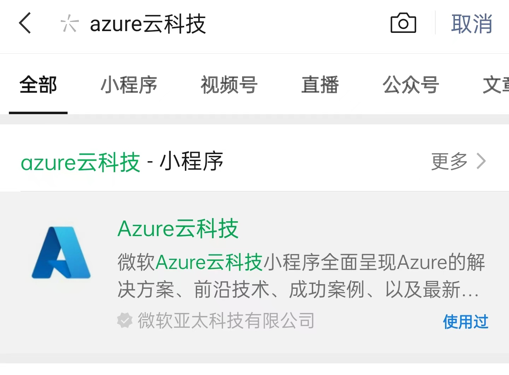

## 活动介绍

伴随着云原生技术的日渐成熟，云原生已经实现了从"概念"到业务"应用"的转向。与此同时，不断迭代的云原生全栈技术为开发者提供了全新的资源、全新的架构、全新的视角，也让开发进一步回归技术，回归个人竞争力。

CNCF、微软、英特尔联合发起首个开源云原生开发者日，在 JFrog、Dapr 中国社区、.NET 中文社区、KubeSphere、云赛空间的鼎力协助之下，新时代的云原生开发者们将共同见证、书写「新开发」时代的历史篇章。

## 视频回放

### 手机浏览方式

请在微信中搜索 "Azure云科技" 小程序：

进入"Azure云科技" 小程序后，在下方选择"精彩视频" -> "开源云原生开发者日"，即可看到本次活动的全部视频：

