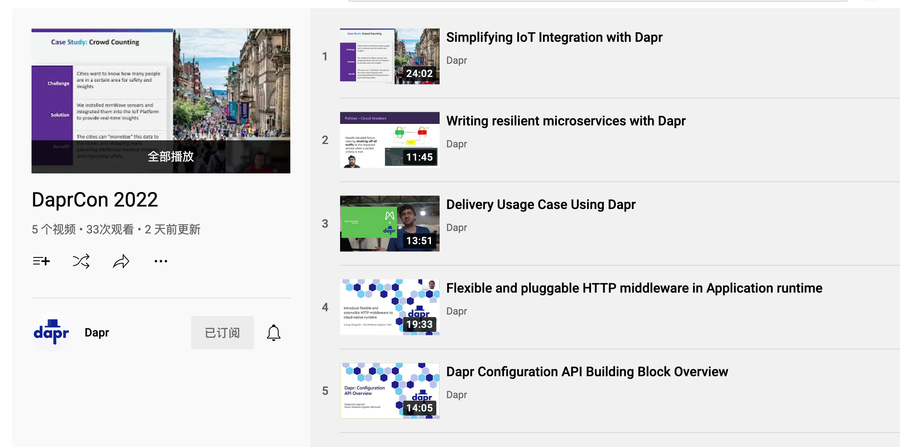
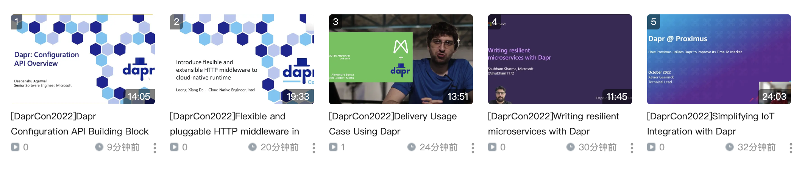

## 大会背景

由于 Dapr 已经加入 CNCF，因此今年的 DaprCon 2022，将由 CNCF 主办，作为参加2022年10月 KubeCon 北美 的项目之一。

### 大会内容

DaprCon 2022大会的演讲内容，请访问 youtube 上 Dapr 官方频道：

https://www.youtube.com/playlist?list=PLcip_LgkYwztXoiR51DNYOfALMKQbclWN

我们也会将内容同步到哔哩哔哩的Dapr中文频道：

https://space.bilibili.com/1898921833/channel/seriesdetail?sid=2730894

