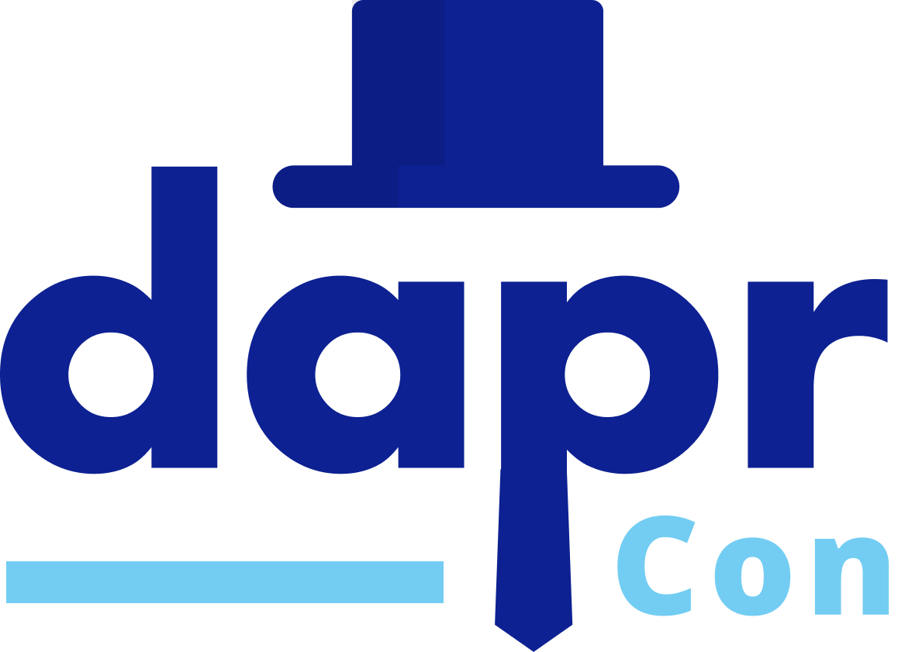

## 提案征集：DaprCon 2022

我们很高兴地宣布，DaprCon 将在2022年再次回归！🎉。

作为CNCF的一部分，今年 DaprCon 将作为2022年 KubeCon North America（NA/北美）的一部分举行。因此，我们希望社区能够提供帮助--请将您的 Dapr 方案、技术示例和用户故事发送给我们。我们将接受社区中任何有兴趣在 DaprCon 上演讲的人的提案。

如果你有兴趣作为演讲者参加，请填写 [DaprCon 2022 提案提交表](https://forms.gle/5zB9ijtc8yx9vdJ68)。

我们将在8月19日（星期五）之前审查提交的材料，如果您的提案看起来很合适，我们将通过电子邮件与您联系。如果您对提交过程或 DaprCon 有任何疑问，请直接给我们发电子邮件：dapr@dapr.io。

> 英文原文请见： https://github.com/dapr/community/blob/master/DaprCon/2022/proposal-submission-form.md

## 大会背景

由于 Dapr 已经加入 CNCF，因此今年的 DaprCon 2022，将由 CNCF 主办，作为参加2022年10月 KubeCon 北美 的项目之一。

DaprCon 2021年活动的演讲视频可以在这里找到：

- [DaprCon Day 1](https://www.youtube.com/watch?v=7ax-ltJjM58)
- [DaprCon Day 2 - Workshops](https://www.youtube.com/watch?v=7ax-ltJjM58)