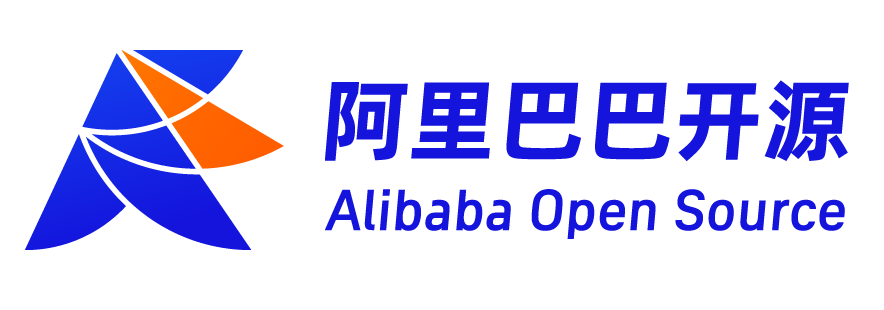
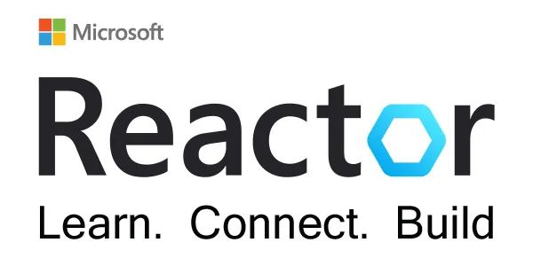

结束了炎热的夏日，或许你还没有喝到秋天的第一杯奶茶，秋天的第一场开发者派对就即将到来。微软携手英特尔、Dapr中文社区联合发起首届Dapr分布式运行时开发者日（Dapr Day），2022年9月3日 10:00-17:30，带来一场专注技术与自由的分布式开发者狂欢。

三个技术流关键词，点燃开发者的9月！

### 回归开发本心

围绕Dapr（分布式运行时）带来知识拓展、技术实操、应用详解、趋势预展相关主题，推动开发方向回归业务需求，推动创新思维回归技术本心，打造属于技术的时代，属于分布式应用的时代。

### 追逐自由风向

技术的发展总是在“自由-拘束-自由”之间螺旋上升。自由的开发语言、开发环境、开发框架以及简易的部署与拓展，Dapr在开发领域刮起一股更自由、更简易的技术风向。

### 齐聚技术大咖

技术的发展总是在来自微软、英特尔、阿里云、腾讯等知名技术企业的13位国内开发者大牛齐聚一堂，分享自己对Dapr开发的心得体会。还有更多海内外神秘大咖，带来全球视野分享。

### 联合主办

### 协办社区

