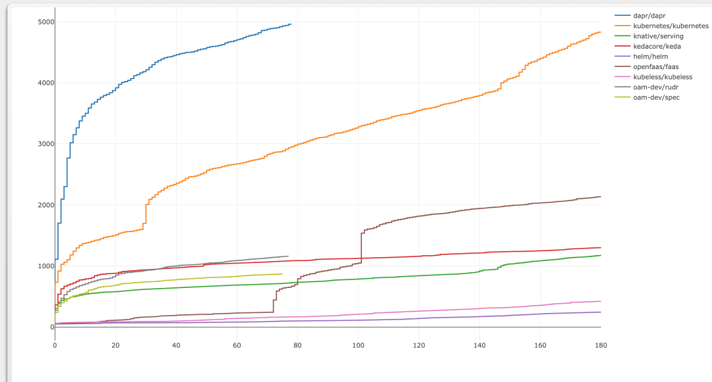
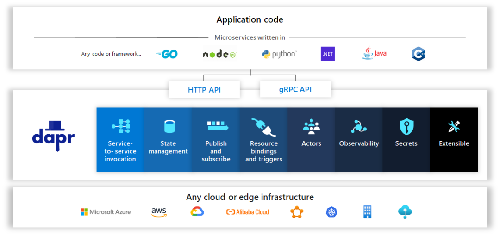
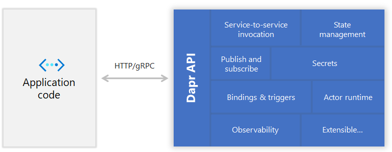
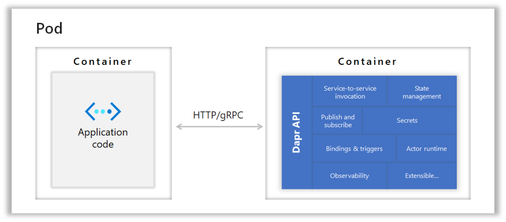

+++
title = "Dapr微服务应用开发系列0：概述"
authors = ["zhangshanyou"]
date =  2022-06-15
draft = false

tags = ["Dapr", "微服务",]
summary = "Dapr是什么，Dapr包含什么，为什么要用Dapr。"
abstract = "Dapr是什么，Dapr包含什么，为什么要用Dapr。"

[header]
image = ""
caption = ""

+++

> 转载自微信公众号文章： [Dapr微服务应用开发系列0：概述](https://mp.weixin.qq.com/s?__biz=MjM5MTc4MDM1MQ==&mid=2651737738&idx=2&sn=79a0ece858d320eea6c0e261a1ef0610&chksm=bd4ab21a8a3d3b0c83fb2702f1457fa57f1863eef8f71a28edb0e23b02d9305973fe05c8818f&mpshare=1&scene=1&srcid=0624bJzOk9GIQhHS0ADSwMAo&sharer_sharetime=1656037346637&sharer_shareid=2a8de5b546734f9f71962adcc21ecf16&exportkey=AQFHs6aAdTGEuC2PJIbfN9Y%3D&acctmode=0&pass_ticket=lpQlPVrVi6IBcR4Q5mEX4dXJ6hoEgud3PFz9wsajmE4d53A2ziAOtKx7pWf775U1&wx_header=0#rd)

## Dapr是什么

Dapr（**D**istributed **Ap**plication **R**untime），是微软Azure内部创新孵化团队的一个开源项目，皆在解决微服务应用开发过程的一些共性问题。以官方文档的说法，Dapr是一个可移植、事件驱动的运行时，让企业开发者更容易利用各种语言和框架构建柔性、无状态和有状态的微服务应用，并运行在云端和边缘。

Dapr的核心由Go语言写成，开发团队一开始有计划使用.NET Core/C#来写，但是考虑到社区的接受程度，遂最终选定Go作为开发语言。当然，还是可以使用任何语言和框架来编写Dapr的扩展功能。由于Dapr要解决的问题确实是大家面临的一些痛点，并且Dapr的设计也独树一帜，所以一经开源，就成为GitHub上Star增长最快的开源项目之一，甚至达到5K Star的速率超过了Kubernetes。

## Dapr包含什么

Dapr做的事情很简单，就是利用Sidecar的模式，把代码中的一些横切关注点需求（Cross-cutting）分离和抽象出来，从而达到**运行环境的独立**和**对外部依赖（包括服务之间）的独立**。

这种独立的途径就是使用开放协议（HTTP和gRPC）来代替依赖特定协议。如下图所示：

从上图我们可以看到，使用Dapr开发的微服务应用理论上可以部署到任意的云提供商、边缘设备、虚拟机、[Service Fabric](http://mp.weixin.qq.com/s?__biz=MzAwNDM5ODM3Mg==&mid=2657496111&idx=1&sn=11d7bf22f3a9b1853209fcc354dda00f&chksm=80be0064b7c989729e9143d5819d6568629ba3661a72de6c40d6c79281abd79dfc4479122663&scene=21#wechat_redirect)集群、Kubernetes集群里面。

并且在如下方面（称之为Building Block）进行外部依赖的抽象：

- 服务之间的调用：不用操心服务注册和发现的问题，也不用操心重试等问题
- 状态的存储：通过键值对来存储应用逻辑的状态，让无状态服务变为有状态服务
- 事件的发布订阅：微服务之间除了直接的远程调用外，更多是依赖事件驱动的模式去产生关系，这里对事件发布订阅进行了统一
- 外部资源的绑定：当需要把事件发布到微服务应用外部，或者从外部接收事件的时候，就可以使用资源绑定
- Actors模式：通过Actors的模式，让微服务可以以单线程的代码实现大规模并行处理。实际上，Actors这部分功能的开发人员就是来自于Service Fabric团队，两者的API也基本保持一致。通过这样的模式，也把Actors这种模式引入到了其他运行平台
- 可观测性：Dapr会帮助微服务应用发出基于W3C Trace Context标准和Open Telemetry规范的度量、日志、跟踪信息，方便对应用进行调试、诊断和监控
- 密钥管理：为微服务提供密钥管理的能力，从而从依赖的外部密钥管理服务中独立出来。

下图很好的展示了以上独立抽象的能力是如何通过Sidecar模式实现的：

（Sidecar进程模式）

（Sidecar容器模式）

虽然Dapr暴露的所有能力都是基于开放协议HTTP和gRPC的，但是为了方便大家快速开发，目前还是提供了如下语言平台的SDK：

- C++ SDK
- Go SDK
- Java SDK，可以和Spring Boot集成
- Javascript SDK，可以和Express集成
- Python SDK，可以和Flask集成
- .NET SDK，可以和ASP.NET Core集成

同时，Dapr还可以和微软开源的FaaS开发框架[Azure Functions](http://mp.weixin.qq.com/s?__biz=MzAwNDM5ODM3Mg==&mid=2657496139&idx=1&sn=da84b794a9b401758a1ae6f4fb5e7ad6&chksm=80be0000b7c98916fede23acfc0b83cac4ea9f051a4ad4ad519235dfacf053353877449623b5&scene=21#wechat_redirect)进行集成，Dapr开发团队也基于Azure Logic App的边缘运行时版本为微服务应用提供了Workflows的能力

## 为什么要用Dapr

根据 [InfoQ的架构和设计技术趋势报告](https://www.infoq.com/articles/architecture-trends-2020/)，微服务已经成为软件开发的主流。但是要开发微服务应用，大部分开发人员还是面临诸多挑战。根本原因在于我们更熟悉经典的3层架构，而对微服务这种分布式应用的开发经验会显得相对不足，很难应对分布式应用所要求的伸缩性、灵活性、可维护性等云原生的特点。

Dapr通过把一些构建微服务应用所需的最佳实践内置到开放、独立的Building Block中，让开发人员更加专注于业务逻辑代码的编写，即可开发出功能强大的微服务应用。

更为重要的是，Dapr还抽象了运行环境，避免微服务应用和运行环境强绑定（这也是很多团队“假上云”——仅使用VM的原因之一）。并且支撑Dapr的运行环境不仅仅限于Cloud，还有广阔的Edge。

毫无疑问，Dapr获得了很多用户的青睐，官网上提到的Geek+使用Dapr构建了仓储机器人的解决方案，Willow使用Dapr构建了智能铁路管理系统。也还有很多大型企业正在采用Dapr来构建他们的微服务应用，甚至国内某互联网巨头不仅计划采用还积极参与了Dapr社区的贡献。