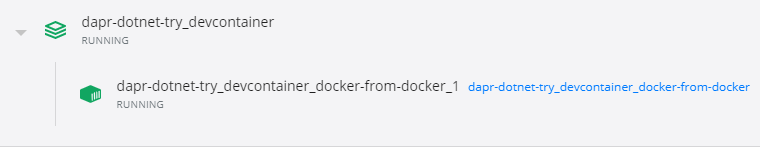

+++
title = "Dapr微服务应用开发系列1：环境配置"
authors = ["zhuyongguang"]
date =  2022-06-16
draft = false

tags = ["Dapr", "微服务",]
summary = "上篇Dapr系列文章简要介绍了Dapr，这篇来谈一下开发和运行环境配置"
abstract = "上篇Dapr系列文章简要介绍了Dapr，这篇来谈一下开发和运行环境配置"

[header]
image = ""
caption = ""

+++

> 转载自微信公众号文章： [Dapr微服务应用开发系列1：环境配置](https://mp.weixin.qq.com/s?__biz=MjM5MTc4MDM1MQ==&mid=2651737738&idx=3&sn=ce147ead5528d7b96be32c4fbffb8e96&chksm=bd4ab21a8a3d3b0cc6dd6994004ad5d47a7d32526946ce047d9d759e717d1f7737fe7816a355&mpshare=1&scene=1&srcid=0624TOONSAA0HQSSJ5ThzhyD&sharer_sharetime=1656037847833&sharer_shareid=2a8de5b546734f9f71962adcc21ecf16&exportkey=AZ1q44DYPMvnaeEClYundoM%3D&acctmode=0&pass_ticket=lpQlPVrVi6IBcR4Q5mEX4dXJ6hoEgud3PFz9wsajmE4d53A2ziAOtKx7pWf775U1&wx_header=0#rd)

## 本机开发环境配置

### 安装Docker

为了方便进行Dapr开发，最好（其实不一定必须）首先在本机（开发机器）上安装Docker。安装方式可以参考Docker的官方文档：https://docs.docker.com/install/。

如果你是Windows平台，那么需要选择Linux容器模式。对于我这样的Windows 10用户而言，个人建议最好的方式就是把Windows 10升级到2004，并启用WSL2，然后启用Docker Desktop WSL 2 backend[1]。这种方式可以获得很好的用户体验和性能。

### 安装CLI

通过如下脚本在不同平台安装最新的CLI（Dapr命令行工具）：

- Windows：

  ```bash
  powershell -Command "iwr -useb https://raw.githubusercontent.com/dapr/cli/master/install/install.ps1 | iex"
  ```

  默认会安装到 `c:\dapr` 目录

- Linux：

  ```bash
  wget -q https://raw.githubusercontent.com/dapr/cli/master/install/install.sh -O - | /bin/bash
  ```

  默认会安装到 `/usr/local/bin` 目录

- MacOS

  ```bash
  curl -fsSL https://raw.githubusercontent.com/dapr/cli/master/install/install.sh | /bin/bash
  ```

默认会安装到 `/usr/local/bin` 目录

或者通过Homebrew来安装：`brew install dapr/tap/dapr-cli`

如果你想手动安装CLI，比如希望安装不同版本或者安装到不同目录。那么可以从 [这里](https://github.com/dapr/cli/releases) 直接下载平台对应的二进制文件并解压到适合的地方，并在PATH中注册这个目录。

### 安装Runtime

在本机安装Dapr运行时分为两种模式，一种是完整模式，一种是简易模式：

- 完整模式：需要Docker环境，运行 `dapr init` ，会自动下载Dapr的运行时 `daprd` ，并在Docker中启动3个容器：

  1. dapr_placement：Image为“daprio/dapr”，用于Dapr的Actor应用的注册
  2. dapr_zipkin：Image为“openzipkin/zipkin”，用于分布式跟踪的处理
  3. dapr_redis：Image为“redis”，用于状态存储和发布订阅处理

- 简易模式：不需要Docker环境，运行 `dapr init --slim`，同样会自动下载Dapr的运行时，并下载placement服务的二进制文件。

两种模式下，有些配置也有所不同：

- 完整模式：会在Linux/MacOS的 `$HOME/.dapr/components` 目录或Windows的 `%USERPROFILE%\.dapr\components` 目录下面创建3个默认组件配置文件：`pubsub.yaml`使用redis容器作为发布订阅组件、`statestore.yaml`使用redis容器作为状态存储组件和`zipkin.yaml`把分布式跟踪的信息导出到zipkin容器；并添加Linux/MacOS的 `$HOME/.dapr/config.yaml` 或Windows的 `%USERPROFILE%\.dapr\config.yaml` 的默认配置文件，重点配置了分布式跟踪的采样率为1。

- 简易模式：虽然会创建默认 `components` 目录，但是不会创建默认组件配置文件。后续运行的时候，你需要自行创建默认组件配置文件或者指定服务的自定义组件配置文件。

## 容器开发环境配置

如果不想在本机安装Dapr的CLI和Runtime，还可以利用Visual Studio Code Remote - Containers[2]的强大功能来实现开发环境的容器化。

Dapr为各种支持的开发语言默认提供了开发容器，方便你把任何项目转换为Dapr应用。

大致步骤如下：

1. 创建项目，（可选）引用对应语言的Dapr SDK
2. 在VS Code中打开项目的工作区（Workspace）
3. 在命令面板中输入“Remote-Containers: Add Development Container Configuration Files...”
4. 在选择开发容器的时候，输入“dapr”来进行查找，选择对应的语言版本，比如“Dapr with C#”
5. VS Code会自动给你的项目添加相关的Dockerfile和其他配置文件（比如“.devcontainer”文件夹）
6. VS Code检测到.devcontainer文件夹后，会提示你是否要使用容器模式打开
7. 通过容器模式打开后，会自动构建项目工作区的容器镜像，同时还会额外启动用于容器开发的placement和zipkin容器实例（名称为：dapr_placement_dapr-dev-container和dapr_zipkin_dapr-dev-container）

开发容器如下图所示：



使用这种开发容器带来的好处就是：整个Dapr开发的依赖环境可以通过Dockerfile来自动配置完成。

## 测试与生产环境配置

虽然Dapr可以运行到任意托管环境，不过目前最自然的选择还是发布到 Kubernetes 集群当中。

首先，你需要配置好一个Kubernetes集群，建议使用Azure Kubernetes Service（AKS），基本可以一键创建好集群[3]。

在做好kubectl和Kubernetes集群的连接之后，就可以开始安装Dapr了。

如果是配置测试环境，那么只需要执行如下命令就可以完成：

```bash
dapr init -k
```

如果要配置生产环境，那么建议使用helm3来进行安装：

```bash
helm repo add dapr https://daprio.azurecr.io/helm/v1/repo
helm repo update
kubectl create namespace dapr-system
helm install dapr dapr/dapr --namespace dapr-system
```

Dapr安装到Kubernetes集群之后，会启动如下Pod：

- dapr-operator: 用来管理Dapr组件的更新和Dapr的kubernetes服务端点（比如状态存储、发布订阅等）
- dapr-sidecar-injector: 用来把Dapr运行时注入到被标记了的应用Pod里面（即把Dapr运行时作为sidecar容器注入到Pod当中）
- dapr-placement: 管理Dapr的Actor应用注册
- dapr-sentry: 管理服务之间的mTLS，并作为一个证书CA

## 总结

至此，Dapr的开发、测试和生产环境就配置完成了，接下来就是进入到开发阶段了。

当然，如果你需要卸载Dapr环境的话，只需要运行如下命令：

```bash

# 卸载本机开发环境
dapr uninstall 

# 卸载本机开发环境包括Redis和Zipkin容器实例
dapr uninstall --all 

# 卸载Kubernetes中的测试环境
dapr uninstall --kubernetes 

# 卸载Kubernetes中的生产环境
helm uninstall dapr -n dapr-system
```

参考资料

- [1] Docker Desktop WSL 2 backend: https://docs.docker.com/docker-for-windows/wsl/
- [2] Visual Studio Code Remote - Containers: https://code.visualstudio.com/docs/remote/containers
- [3] Quickstart: Deploy an Azure Kubernetes Service cluster using the Azure CLI: https://docs.microsoft.com/en-us/azure/aks/kubernetes-walkthrough