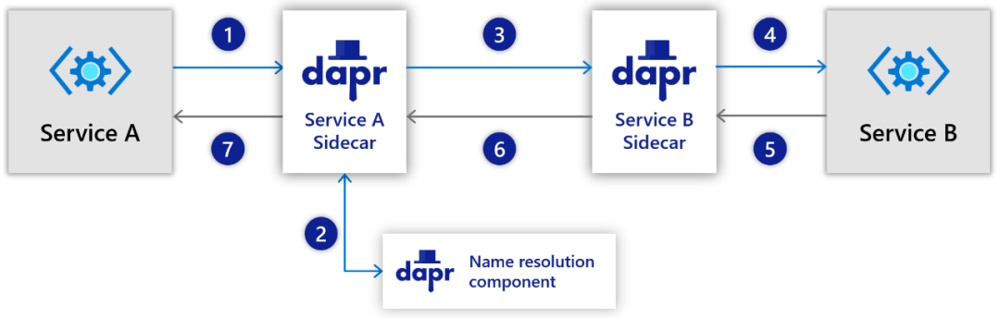

+++
title = "Dapr微服务应用开发系列3：服务调用构件块"
authors = ["zhangshanyou"]
date =  2022-06-18
draft = false

tags = ["Dapr", "微服务",]
summary = "这篇开始逐一深入介绍各个构件块，从服务调用开始"
abstract = "这篇开始逐一深入介绍各个构件块，从服务调用开始"

[header]
image = ""
caption = ""

+++

> 转载自微信公众号文章： [Dapr微服务应用开发系列3：服务调用构件块](https://mp.weixin.qq.com/s?__biz=MjM5MTc4MDM1MQ==&mid=2651737776&idx=3&sn=9d1479c0924a6b41c5b9ca4722848949&chksm=bd4ab2208a3d3b36ab0e19c94b1d82f80e5740d3da5f8d485ee1a79ec9516bb13adf07ca727e&mpshare=1&scene=1&srcid=0624DNoq7a2dNPHdjAWMgPsU&sharer_sharetime=1656039105343&sharer_shareid=2a8de5b546734f9f71962adcc21ecf16&exportkey=Ac5lSNsnGElb3gqRj%2FJ7kSA%3D&acctmode=0&pass_ticket=lpQlPVrVi6IBcR4Q5mEX4dXJ6hoEgud3PFz9wsajmE4d53A2ziAOtKx7pWf775U1&wx_header=0#rd)


## 原理

所谓服务调用，就是通过这个构件块让你方便的通过HTTP或者gRPC协议同步调用其他服务的方法，这些方法也是通过HTTP或者gRPC来暴露的。而方便的含义在于，你无需担心如下问题：

- 如何发现其他服务，不用关心调用的链路以及负载均衡
- 调用过程中如何保证安全性
- 在遇到瞬态错误或中断的时候如何处理重试
- 如何记录调用链路的跟踪信息

Dapr本身并没有提供额外的API让你去利用这些特性，上面所有的一切都通过Sidecar模式帮你横切到Dapr边车实例中自动处理。如下图所示：



你的服务对其他服务发起的一切服务调用都要经过Dapr边车实例，其他服务接收的一切服务调用同样也要经过Dapr实例。分别执行如下步骤：

1. 如果服务A要对服务B发起调用（不管HTTP还是gRPC），其实调用的目标是服务A的Dapr边车；
2. Dapr会利用Dapr的命名解析组件（后续文章会介绍）来找到服务B的的Dapr边车位置；
3. 然后服务A的Dapr边车就把调用请求转发给服务B的边车了；
4. 由于服务B的边车和服务B是配对的，知道服务B的调用信息（比如端口），所有请求被再次转发给服务B，服务B完成服务调用的业务处理；
5. 服务B处理完，把服务调用响应结果返回给服务B的Dapr边车；
6. 服务B的Dapr边车返回响应结果给服务A的Dapr边车；
7. 服务A的Dapr边车最后把响应结果返回给服务A本身。

## 能力

从上面的原理可以看出，通过成对的Dapr边车，来作为服务之间调用的中介，就可以简化服务和Dapr边车之间的调用方式，就可以强化边车之间的调用方式。

这什么意思呢？就是Dapr把服务调用之间的一些共性且复杂的问题帮你解决掉（两个边车之间的调用），你只用采用最基本的HTTP和gRPC功能来暴露你的服务或者调用你的服务（服务与边车之间的调用）。由此，你可以获得Dapr给你提供的如下能力：

- 寻址和负载均衡：Dapr自动帮你找到要调用的目标服务，并自动对目标服务的多个实例进行负载均衡。
- 命名空间范围限定：可以把服务放到特定的命名空间内，从而方便隔离各类服务。这个能力最常见的用途就是用命名空间来限定运行环境（开发、测试、生产等）。不过这个能力和托管环境有关，目前只有Kubernetes支持。
- 重试：在分布式环境中，远程服务出现瞬态故障是很常见的（可能由网络、负载、安全等因素造成），所以在微服务架构中针对同步服务调用必须实现重试机制。传统的方式下，（就算有重试框架的帮助下）需要在业务逻辑代码中编写很多冗长的重试代码。通过Dapr边车内置的重试机制极度简化了这个问题。目前Dapr的会间隔1秒最多重试3次。
- 安全通信：分布式环境，通信的安全性也是一个需要重点关注的领域。Dapr提供了一个名为Sentry的基础服务，让边车之间的通信基于mTLS来进行安全保证（mTLS的证书会自动更新）。
- 安全访问：在安全通信的mTLS证书的基础，可以通过配置信任域（TrustDomain）和应用标识（App Identity）来进行访问控制。在这里暂时不对此话题展开。
- 可观测性：默认情况下，Dapr会收集边车之间服务调用的度量和跟踪信息，从而帮助开发人员来洞察和诊断应用程序。也就是说，高大上的分布式跟踪直接由Dapr提供内置支持了。
- 可替换的服务发现：原理里面提到Dapr之间的服务发现会依赖于一个称之为命名解析组件的东西，实际上这个东西可以在不同的托管环境中进行替换。默认情况下，在Kubernetes里面，是使用DNS Service来作为命名解析组件的实现。

## 规范

由于服务调用这个构件块并没有为服务应用提供什么可直接访问的能力，所以整个规范也相对简单，仅仅规定了调用其他应用的URL模式，即通过如下地址来发送HTTP请求（或gRPC请求）：

```http
POST/GET/PUT/DELETE http://localhost:<daprPort>/v1.0/invoke/<appId>/method/<method-name>
```

上面的URL地址涉及到几个约定好的参数：

- daprPort：这是Dapr边车暴露的HTTP端口（默认50001）或者gRPC端口（默认3500）；可以通过 `dapr run` 的 `--dapr-grpc-port` 或 `--dapr-http-port` 来设置；应用内可以通过 `DAPR_HTTP_PORT` 或 `DAPR_GRPC_PORT` 这两个环境变量来获得端口值。
- appId：这是目标应用的AppId，在命名空间（如果有）内唯一的标识；可以通过 `dapr run` 的 `--app-id` 来设置。
- method-name：这是需要调用的目标应用的接口名称，一般是根路径（比如 `/hello` ）或者嵌套路径（比如 `/api/weather` ）也是支持的。

## DOTNET SDK

作为DOTNET博主，我就仅介绍DOTNET SDK的情况。由于服务调用规范本身就简单，所以SDK也相对简单。对于被调用端，目前并没有提供任何辅助的能力，你只需要使用适合的现成框架来暴露HTTP或者gRPC端点。

对于调用端，提供了一个客户端类 DaprClient，有如下方法来帮助你发送服务调用的请求：

- InvokeMethodAsync
- InvokeMethodRawAsync
- InvokeMethodWithResponseAsync

对于DaprClient具体的用法可以参见这里的示例代码：https://github.com/dapr/dotnet-sdk/blob/master/samples/Client/DaprClient/Program.cs#L217

```
internal static async Task InvokeDepositServiceOperationAsync(DaprClient client)
{
    Console.WriteLine("Invoking deposit");
    var data = new { id = "17", amount = (decimal)99 };

    // Invokes a POST method named "depoit" that takes input of type "Transaction" as define in the RoutingSample.
    Console.WriteLine("invoking");

    var a = await client.InvokeMethodAsync<object, Account>("routing", "deposit", data, HttpInvocationOptions.UsingPost());
    Console.WriteLine("Returned: id:{0} | Balance:{1}", a.Id, a.Balance);

    Console.WriteLine("Completed");
}
```

## 用法与例子

要了解服务调用构件块具体如何使用的，照着官方文档做就是了。

对于不想看英文文档的同学，可以关注我们 [Dapr 中国社区的文档翻译](../../translation/)（也欢迎加入）

另外我在单独写一个Dapr的Quickstarts（正在逐步完善中），大家可以参考：https://github.com/heavenwing/dapr-dotnet-quickstarts/tree/main/ServiceInvocation

## 彩蛋——如何暴露gRPC端点

最后，官方文档里面其实没有把如何暴露gRPC端点这个话题讲清楚，不过在SDK中其实已经把dapr的Protobuf 封装好了（其实是自动生成好了），你引用了SDK中的Dapr.Client包就可以直接使用。我之前根据dapr的protobuf协议实现了一个例子，其实就是实现 `AppCallback.AppCallbackBase` 的 `Task<InvokeResponse> OnInvoke(InvokeRequest request, ServerCallContext context)` 方法，并通过ASP.NET Core来托管。代码已经合并到SDK中的samples部分，见：https://github.com/dapr/dotnet-sdk/blob/master/samples/AspNetCore/GrpcServiceSample/Readme.md。调用代码见：https://github.com/dapr/dotnet-sdk/blob/master/samples/Client/DaprClient/Program.cs#L298

后来我觉得这个示例更加类似quickstarts，而不是SDK的示例，后面我会把这个示例添加到我的quickstarts中，并在SDK中去实现一个真正进行gRPC端点暴露开发的辅助能力，敬请期待。