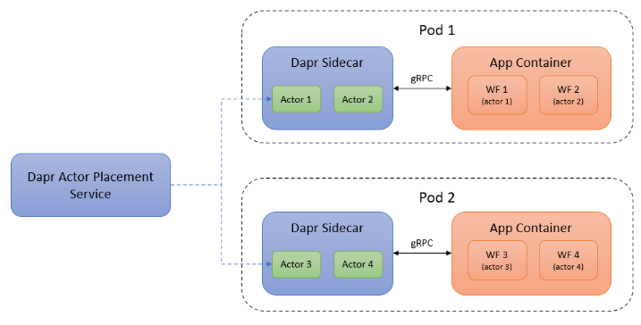
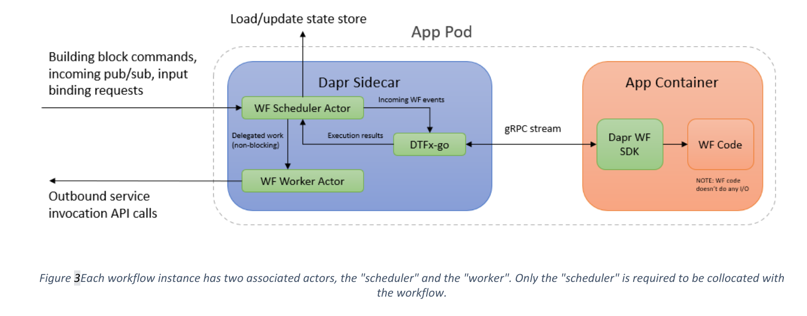

+++
title = "[译] Dapr 工作流提案"
authors = ["aoxiaojian"]
date =  2022-06-02
draft = false

tags = ["Dapr", "workflow", "翻译", "提案"]
summary = "Dapr 最近提出了一个新的提案，计划在 Dapr Runtime 中构建工作流引擎"
abstract = "Dapr 最近提出了一个新的提案，计划在 Dapr Runtime 中构建工作流引擎"


[header]
image = ""
caption = ""
+++

> 译者注：Dapr 最近提出了一个新的提案，计划在 Dapr Runtime 中构建工作流引擎，社区反映非常积极。由于提案内容比较长，因此翻译过来以帮助阅读。原文和社区讨论请见： https://github.com/dapr/dapr/issues/4576 

本文档建议扩展 Dapr 运行时以包含新的工作流构建块。 此构建基与轻量级、可移植的工作流引擎相结合，将使开发人员能够将工作流表达为可以使用 Dapr 运行时执行、交互、监视和调试的代码块

## 为什么使用它？

许多复杂的业务流程被很好地建模为 *工作流* - 一组需要编排的步骤，需要弹性和保证完成（成功或失败都是完成）。 要构建这样的工作流程，开发人员经常需要解决许多复杂的问题，包括（但不限于）：

* 调度
* 生命周期管理
* 状态存储
* 监控和调试
* 弹性
* 故障处理机制

根据可用数据，很明显，工作流程非常受欢迎。在撰写本文时，在数以万计的 Azure 订阅中，托管工作流及其任务的每日执行次数为每天数十亿次。

## 什么是工作流？

就本提案而言， *workflow* 定义为应用程序逻辑，用于定义以下业务流程或数据流：

* 具有特定的、预定义的确定性生命周期（例如，挂起 -> 正在运行 -> [已完成|已失败|已终止]）
* 保证完成
* 是持久的（即在面对暂时性错误时完成）
* 可以安排在将来某个时间或之后启动或执行步骤
* 可以暂停和恢复（显式或隐式）
* 可以串行或并行执行工作流的某些部分
* 可由外部代理直接寻址（即可以直接与工作流实例交互 - 暂停、恢复、查询等）
* 可能是有版本控制的
* 可能是有状态的
* 可以创建新的子工作流，并可选择等待这些工作流完成，然后再进行
* 可能依赖外部组件来执行其作业（即 HTTPS API 调用、发布/订阅消息队列等）

## 为什么选择 Dapr？

Dapr 已经包含许多为工作流的执行提供可靠性、可伸缩性和持久性所需的构建块。 在 Dapr 中构建这样的引擎，并提供必要的构建块，将有助于通过现有功能的可重用性和独立于底层的执行机制来提高开发人员的工作效率，从而提高可移植性。

除了内置的执行引擎之外，Dapr 还可以为已经使用这些工具的用户提供一致的编程接口，以便与第三方工作流执行系统（即 AWS SWF、Apache Camel、Drools）进行交互。 从而提供了一个标准化的接口，用于处理外部工作流以及在 Dapr 内部运行的工作流。

# 提案

## 变更的高级概述

我们建议将以下特性/功能添加到 Dapr 运行时：

* 新的“workflow”构建块
* 嵌入到 Dapr sidecar 中的可移植的轻量级工作流引擎，能够通过 Dapr 的构建块支持长时间运行、弹性和持久的工作流
* 富有表现力、对开发人员友好的编程模型，用于将 _工作流构建为代码_
* 支持容器化、声明式工作流（如 CNCF serverless 工作流规范）
* 对 Dapr 仪表板的扩展，用于监视/管理工作流执行
* 用于与工作流交互的 API

## 工作流构建块

如前所述，此提案包括添加新的工作流构建块。 与大多数其他 Dapr 构建块（状态存储、pubsub 等）一样，工作流构建基将包含两个主要内容：

* 可插拔的组件模型，用于集成各种工作流引擎
* 一组 API，用于管理工作流（启动、调度、暂停、恢复、取消）

与对 actor 的内置支持类似，我们还建议为工作流实现内置运行时（请参阅下一节中介绍的 DTFx-go 引擎）。 与 actor 不同，工作流运行时组件可以替换为替代实现。 如果开发人员想要使用其他工作流引擎，例如外部托管的工作流服务（如 Azure Logic Apps、AWS Step Functions 或 Temporal.io），则可以使用其他社区贡献的工作流组件来实现。

对于供应商来说，此构建块的价值在于，其平台支持的工作流可以公开为支持 HTTP 和 Dapr SDK 的 API。 MTLS、分布式跟踪等不太明显但很有用处的功能也将可用。 各种抽象（如异步 HTTP 轮询）也可以通过 Dapr 提供支持，而无需工作流供应商自己实现它。


## DTFx-go 介绍

我们建议在 Dapr sidecar 中添加一个轻量级，可移植的嵌入式工作流引擎（DTFx-go），该引擎在其底层实现中利用现有的 Dapr 组件，包括 _actor_ 和 _状态存储_。 由于是轻量级和可移植的，开发人员将能够以最小的开销执行在 DFTx-go 本地以及生产中运行的工作流；这通过将工作流与用户喜欢的现有 Dapr 开发模型相集成来增强开发者体验。

新引擎将使用 Go 编写，并受到现有 Durable Task Framework (DTFx) 引擎的启发。 我们将这个新版本的框架称为DTFx-go，以区别于.NET实现（这不是本提案的一部分），它将作为一个开源项目存在，具有宽松的许可证，例如Apache 2.0，以便它作为CNCF项目的依赖项保持兼容。 请注意，确保此引擎保持轻量级非常重要，以避免显著增加 Dapr sidecar 的大小。

重要的是，DTFx-go 不会暴露给应用层。 相反，Dapr sidecar 将通过 gRPC 流公开 DTFx-go 功能。 Dapr sidecar 不会执行任何特定于应用程序的工作流逻辑或加载任何声明性工作流文档。 相反，应用容器将负责托管实际的工作流逻辑。 Dapr sidecar 可以通过 gRPC 向连接的应用程序的工作流逻辑发送和接收工作流命令，代表工作流执行命令（服务调用、调用绑定等）。 其他问题（如激活、横向扩展和状态持久性）将由内部管理的 actor 处理。 关于所有这些的更多细节将在后续章节中讨论。


### 执行、调度和弹性

在内部，Dapr 工作流实例将作为 **actor**实现。 Actor 通过 gRPC 流与工作流 SDK 通信来驱动工作流执行。 通过使用 actor，我们已经解决了放置和可扩展性的问题。



单个工作流的执行将使用 **actor reminder** 触发，因为它们既是 _persistent_ 又是 _durable_ （工作流的两个关键功能）。 如果容器或节点在工作流执行期间崩溃，则 actor 的 reminder 将确保它再次激活并从中断处恢复（使用状态存储来提供持久性，见下文）。

为了防止工作流（无意中）阻塞，每个工作流将由两个单独的 actor 组成，一个充当调度（scheduler）/协调器（coordinator），另一个执行实际工作（调用API服务，执行计算等）。



### 状态和持久性的存储

为了使工作流执行在面对暂时性错误时可靠地完成，它必须是 *持久的* - 这意味着它能够在取得进展时在检查点存储数据。 为了实现这一点，工作流执行将依赖于 Dapr 的状态存储来提供稳定的存储，以便在工作流被显式暂停或某个步骤提前终止（系统故障、资源不足等）时，可以从已知状态安全地恢复工作流。

## 工作流即代码

术语"工作流即代码(workflow as code)"是指使用通用编程语言实现工作流逻辑。 “工作流即代码”用于越来越多的新式工作流框架，例如 Azure Durable Functions、Temporal.io 和Prefect (Orion)。 这种方法的优点是它对开发人员友好。 开发人员可以使用他们已经知道的编程语言（无需学习新的DSL或YAML模式），他们可以访问语言的标准库，可以构建自己的库和抽象，可以使用调试器和检查局部变量，甚至可以为他们的工作流编写单元测试，就像他们编写应用程序逻辑的任何其他部分一样。

Dapr SDK 将与 Dapr sidecar 中的 DTFx-go gRPC 端点进行内部通信，以接收新的工作流事件并发送新的工作流命令，但这些协议详细信息将对开发人员隐藏。 由于工作流协议的复杂性，我们没有为此功能的运行时方面提供任何HTTP API。

## 支持声明式工作流

我们预计工作流作为代码在开发人员中非常受欢迎，因为与声明式工作流建模语言相比，使用代码对于开发人员来说既非常自然，又更具表现力和灵活性。 尽管如此，仍然会有用户更喜欢或要求工作流是声明式的。 为了支持这一点，我们建议将声明式工作流的体验构建为“工作流即代码”基础之上的一个层。 以这种方式可以支持各种声明式工作流。 例如，此模型可用于支持 AWS Step Functions 工作流语法、Azure Logic Apps 工作流语法，甚至 Google Cloud Workflow 语法。 但是，出于此提案的目的，我们将重点介绍支持 CNCF serverless工作流规范的情况。 但请注意，建议的模型可用于支持任意数量的声明式多工作流架构。

### CNCF serverless工作流

Serverless工作流 （SLWF） 由基于开源标准的 DSL 和开发工具组成，用于在 JSON 或 YAML 中创作和验证工作流。 SLWF 被特别选择用于本提案，因为它代表了一种云原生和行业标准的工作流创作方式。 有一组已经存在的开源工具，用于生成和验证这些可以由社区采用的工作流。 它也是 Dapr 的理想选择，因为它位于 CNCF 的保护伞下（目前是一个 sandbox 项目）。 本提案将通过为 SLWF 项目提供轻量级，可移植的运行时（即Dapr sidecar）来支持它。

### 托管 serverless 工作流

在本提案中，我们使用 Dapr SDK 来构建一个新的，可移植的 SLWF 运行时，该运行时将使用 Dapr sidecar。 最有可能的是，它被实现为可重用的容器镜像，并支持从 Dapr 状态存储加载工作流定义文件（需要确定确切的细节）。 请注意，Dapr sidecar 不会加载任何工作流定义。 相反，sidecar 只是驱动工作流的执行，将所有其他细节留给应用层。


## API

### 启动工作流 API

#### HTTP / gRPC
开发人员可以通过向 Dapr sidecar 发出 HTTP（或 gRPC）API 调用来启动工作流实例：

`POST http://localhost:3500/v1.0/workflows/{workflowType}/{instanceId}/start`

假定工作流具有由 {workflowType} 参数标识的类型。 还必须使用唯一的 {instanceId} 值创建每个工作流实例。 请求的有效负载是工作流的输入。 如果已存在具有此 ID 的工作流实例，则此调用将失败，并显示 HTTP 409 Conflict。

为了支持 HTTP 客户端的异步 HTTP 轮询模式，此 API 将返回 HTTP 202 Accepted 响应，其 Location 标头包含可用于获取工作流状态的 URL（请参阅下面的进一步操作）。 工作流完成后，此端点将返回 HTTP 200 响应。 如果失败，端点可以返回 4XX 或 5XX 错误 HTTP 响应代码。 其中一些详细信息可能需要可配置，因为没有用于异步 API 处理的通用协议。

#### Input bindings

对于某些类型的自动化场景，直接从 Dapr input bindings 触发新的工作流实例可能很有用。 例如，使用 Twitter input binding 触发工作流以响应来自特定用户帐户的推文可能很有用。 另一个例子是启动一个新的工作流来响应 Kubernetes 事件，如 deployment 创建事件。

工作流的实例 ID 和输入负载取决于 input binding 的配置。 例如，用户可能希望使用 Tweet 的唯一 ID 或 Kubernetes deployment 的名称作为 instance ID。

#### Pub/Sub

工作流也可以直接从 pub/sub 事件启动，类似于 Actor pub/sub 的提案。 Pub/sub 主题的配置可用于标识用于初始化工作流的相应 instance ID 和输入工作负载。 在最简单的情况下，cloud event 消息的 source + ID 可用作工作流的 instance ID。

### 终止工作流 API

#### HTTP / gRPC
工作流实例也可以使用显式 API 调用来终止：

`POST http://localhost:3500/v1.0/workflows/{workflowType}/{instanceId}/terminate`

工作流终止主要是服务运维人员在需要取消特定业务流程时，或者工作流出现问题需要停止以减轻对其他服务的影响时执行的操作。

如果 POST 请求中包含有效负载，则该有效负载将另存为工作流实例的输出。

### 发起事件 API

当工作流可以等待外部事件并由外部事件驱动时，它们特别有用。 例如，工作流可以订阅 pubsub 主题中的事件，如电话验证示例中所示。 但是，此功能不应仅限于 pub/sub 事件。

#### HTTP / gRPC

应该存在用于将事件直接发布到工作流实例的 API：

`POST http://localhost:3500/v1.0/workflows/{workflowType}/{instanceId}/raiseEvent`

“发起事件”API 的结果是 HTTP 202 Accepted，表示事件已收到但可能尚未处理。 工作流可以使用 waitForExternalEvent SDK 方法使用外部事件。

### 获取工作流元数据 API

#### HTTP / gRPC
用户可以使用显式 API 调用提取工作流实例的元数据：

`GET http://localhost:3500/v1.0/workflows/{workflowType}/{instanceId}`

此调用的结果是工作流实例元数据，例如其开始时间、运行时状态、完成时间（如果已完成）以及自定义或特定于运行时的状态。 如果目标运行时支持，则还可以使用查询 API 提取工作流输入和输出。

### 清除工作流元数据 API

用户可以使用以下 API 删除与工作流关联的所有状态：

`DELETE http://localhost:3500/v1.0/workflows/{workflowType}/{instanceId}`

使用嵌入式工作流组件时，这将删除工作流的底层 actor 存储的所有状态。

# 脚注和示例

## 示例 1：银行交易

在此示例中，工作流实现为 JavaScript 生成器函数。 “bank1”和“bank2”参数是使用 Dapr 的微服务应用，每个应用都公开“ withdraw（提款）”和“ deposit（存款）”API。 工作流可用的 Dapr API 来自于上下文参数对象，并返回一个 "任务"，这实际上与 Promise 相同。 对任务调用 yield 会导致工作流持久检查其进度，并等待 Dapr 使用服务方法的输出进行响应。 任务的值就是服务调用的结果。 如果任何服务方法调用因错误而失败，则该错误将作为引发的 JavaScript 错误浮现出来，可以使用正常的 try/catch 语法捕获该错误。 此代码也可以使用 Node.js 调试器进行调试。

请注意，有关如何编写代码的详细信息将因语言而异。 例如，C# SDK 将允许开发人员使用 async/await 而不是 yield。 无论语言细节如何，核心功能在所有语言中都是相同的。


```javascript
import { DaprWorkflowClient, DaprWorkflowContext, HttpMethod } from "dapr-client"; 

const daprHost = process.env.DAPR_HOST || "127.0.0.1"; // Dapr sidecar host 

const daprPort = process.env.DAPR_WF_PORT || "50001";  // Dapr sidecar port for workflow 

const workflowClient = new DaprWorkflowClient(daprHost, daprPort); 

// Funds transfer workflow which receives a context object from Dapr and an input 
workflowClient.addWorkflow('transfer-funds-workflow', function*(context: DaprWorkflowContext, op: any) { 
    // use built-in methods for generating psuedo-random data in a workflow-safe way 
    const transactionId = context.createV5uuid(); 

    // try to withdraw funds from the source account. 
    const success = yield context.invoker.invoke("bank1", "withdraw", HttpMethod.POST, { 
        srcAccount: op.srcAccount, 
        amount: op.amount, 
        transactionId 
    }); 

    if (!success.success) { 
        return "Insufficient funds"; 
    } 

    try { 
        // attempt to deposit into the dest account, which is part of a separate microservice app 
        yield context.invoker.invoke("bank2", "deposit", HttpMethod.POST, {
            destAccount: op.destAccount, 
            amount: op.amount, 
            transactionId 
        }); 
        return "success"; 
    } catch { 
        // compensate for failures by returning the funds to the original account 
        yield context.invoker.invoke("bank1", "deposit", HttpMethod.POST, { 
            destAccount: op.srcAccount, 
            amount: op.amount, 
            transactionId 
        }); 
        return "failure"; 
    } 
}); 

// Call start() to start processing workflow events 
workflowClient.start(); 
```

## 示例 2：电话验证

下面是另一个示例，演示开发人员如何构建短信电话验证工作流。 工作流接收某个用户的电话号码，创建一个验证码，将验证码传送到用户的 SMS 号码，并等待用户以正确的验证码进行响应。

重要的一点是，端到端工作流可以表示为单个易于理解的函数。 状态（如验证码）可以简单地存储在本地变量中，而不是直接依靠 actor 来显式保存状态，从而大大降低了整体代码的复杂性，并使解决方案易于进行单元测试。

```javascript 
import { DaprWorkflowClient, DaprWorkflowContext, HttpMethod } from "dapr-client"; 

const daprHost = process.env.DAPR_HOST || "127.0.0.1"; // Dapr sidecar host 
const daprPort = process.env.DAPR_WF_PORT || "50001";  // Dapr sidecar port for workflow 
const workflowClient = new DaprWorkflowClient(daprHost, daprPort); 

// Phone number verification workflow which receives a context object from Dapr and an input 
workflowClient.addWorkflow('phone-verification', function*(context: DaprWorkflowContext, phoneNumber: string) { 

    // Create a challenge code and send a notification to the user's phone 
    const challengeCode = yield context.invoker.invoke("authService", "createSmsChallenge", HttpMethod.POST, { 
        phoneNumber 
    }); 

    // Schedule a durable timer for some future date (e.g. 5 minutes or perhaps even 24 hours from now) 
    const expirationTimer = context.createTimer(challengeCode.expiration); 

    // The user gets three tries to respond with the right challenge code 
    let authenticated = false; 

    for (let i = 0; i <= 3; i++) { 
        // subscribe to the event representing the user challenge response 
        const responseTask = context.pubsub.subscribeOnce("my-pubsub-component", "sms-challenge-topic"); 

        // block the workflow until either the timeout expires or we get a response event 
        const winner = yield context.whenAny([expirationTimer, responseTask]); 

        if (winner === expirationTimer) { 
            break; // timeout expired 
        } 

        // we get a pubsub event with the user's SMS challenge response 
        if (responseTask.result.data.challengeNumber === challengeCode.number) { 
            authenticated = true; // challenge verified! 
            expirationTimer.cancel(); 
            break; 
        } 
    } 

    // 返回值可以作为工作流状态的一部分。 或者，我们可以发送通知。 
    return authenticated; 
}); 

// 调用 listen() 开始处理工作流事件
workflowClient.listen(); 
```


## 示例 3：用于监测患者生命体征的声明式工作流

下面是一个非常简单的 SLWF 工作流定义的例子，它监听三种不同的事件类型并根据收到的事件调用函数。

```json
{ 
    "id": "monitorPatientVitalsWorkflow", 
    "version": "1.0", 
    "name": "Monitor Patient Vitals Workflow", 
    "states": [ 
      { 
        "name": "Monitor Vitals", 
        "type": "event", 
        "onEvents": [ 
          { 
            "eventRefs": [ 
              "High Body Temp Event", 
              "High Blood Pressure Event" 
            ], 
            "actions": [{"functionRef": "Invoke Dispatch Nurse Function"}] 
          }, 
          { 
            "eventRefs": ["High Respiration Rate Event"], 
            "actions": [{"functionRef": "Invoke Dispatch Pulmonologist Function"}] 
          } 
        ], 
        "end": true 
      } 
    ], 
    "functions": "file://my/services/asyncapipatientservicedefs.json", 
    "events": "file://my/events/patientcloudeventsdefs.yml" 
} 
```

此工作流中定义的函数将映射到 Dapr 服务调用。 同样，这些事件将映射到传入的 Dapr pub/sub 事件。 在幕后，运行时（使用前面提到的 Dapr SDK APIs 构建）处理与 Dapr sidecar 的通信，后者反过来管理状态的检查点和工作流的恢复语义。 