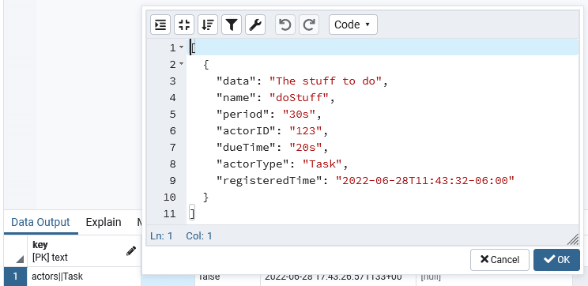

+++
title = "[译] Virtual Actors : Dapr vs Orleans"
authors = ["aoxiaojian"]
date =  2022-06-30
lastmod = 2022-06-30
featured = false

tags = ["Dapr", "actor", "翻译"]
summary = "如果你想了解更多关于分布式应用程序或 virtual actor 的想法，我建议你从 Dapr 开始。 Orleans 是最初的先驱，而 Dapr 是一次重新开始，它将提升到一个新的水平。"
abstract = "如果你想了解更多关于分布式应用程序或 virtual actor 的想法，我建议你从 Dapr 开始。 Orleans 是最初的先驱，而 Dapr 是一次重新开始，它将提升到一个新的水平。"

[header]
image = ""
caption = ""

+++

> 译者注：作者为了研究 virtual actor，实际使用并对比了 Orleans 和 Dapr 项目，得出的一些可供大家参考的结论。
>
> 原文请见： [Virtual Actors : Dapr vs Orleans](https://dev.to/aaronblondeau/virtual-actors-dapr-vs-orleans-30f0)

在过去的一周里，我通过研究 virtual actor 的想法，进入了软件开发的森林。 我最终研究了两个不同的框架： [Dapr](https://dapr.io/) 和 [Orleans](https://docs.microsoft.com/en-us/dotnet/orleans/)。

两者都是非常简洁的项目，有大量有趣的用例。 两者都使用 “virtual” actor 的概念。 Virtual actor 是状态和逻辑的单位，它：

- 可以通过 id 唯一标识
- 是单线程的
- 可以在内存中或持久化 - 它的生命周期由框架管理

我真的很喜欢 virtual actor 的想法，并且觉得它们对我非常有帮助：我需要构建一个可扩展且可靠的工具来处理复杂的任务工作流。 如果每个任务都是一个单线程 virtual actor 组件，那么争用条件（race condition）问题就会消失。

因为 Orleans 和 Dapr 都是 Microsoft 项目，所以我设想有一天会在 Microsoft 自助餐厅进行一场西部故事风格的决斗。

## Orleans

我从 Orleans 开始，因为在 YouTube 上看到一些关于它的视频后，它引起了我的注意。 开始非常糟糕，因为我想我会使用他们所有 NuGet 包的 4.x 版本。 然而，他们的文档绝对没有一个适用于 4.x 包。 我最终改用 3.6.2 版本。

### Grains / State / Timers

创建一个跟踪自己的状态并执行操作的 grain 非常简单。 我甚至能够遵循 grain 持久化的文档，并创建了自己的 IGrainStorage 的CosmosDB（SQL API）实现。

### Reminders

Reminders（提醒）也很容易设置。 直到我尝试为他们配置真实世界的持久化。 在我研究的这一点上，我试图保持整洁，并将所有内容存储在 ComsosDB 中。 不幸的是，我根本无法获得让 Orleans 工作的 [ reminder 持久化包](https://github.com/OrleansContrib/Orleans.CosmosDB)。 我最终不得不改用 [AzureStorage](https://www.nuget.org/packages/Microsoft.Orleans.Reminders.AzureStorage/) 包。 所以现在我的数据一半在 SQL API 帐户中，一半在 Table API 帐户中。

### Streams

这里不太顺利。 在 Orleans中，stream 使用 GUID 和可选的命名空间来标识。 我敢肯定，stream 必须由 GUID 标识是有充分理由的，但，这是不切实际的。

我对 stream 感到非常沮丧，因为我能够轻松地创建它们，但是一旦我停止并重新启动我的项目然后触发一个新事件，一切都会爆炸。

接下来是一条非常有价值的信息，因为我花了 8 个小时对 Orleans 代码进行逆向工程才弄清楚：

*当 grain 是 stream 订阅者时，该 grain 必须在其 OnActivateAsync 方法中的订阅句柄上调用 ResumeAsync，否则您将遇到无法识别的错误崩溃。*

```c#
public override async Task OnActivateAsync()
{
    // For some reason we have to re-subscribe to streams here.
    // Otherwise we get Null pointer errors
    // or grain extension not installed errors
    // depending on combo of storage providers used
    var streamProvider = GetStreamProvider("SMSProvider");
    var stream = streamProvider.GetStream<int>(Guid.Parse("0f8fad5b-d9cb-469f-a165-70867728950e"), "HitsLog");

    // Resume old subscriptions:
    var handles = await stream.GetAllSubscriptionHandles();
    foreach (var handle in handles)
    {
        await handle.ResumeAsync(this);
    }
}
```


我还遇到了相同订阅被重复的问题，所以我使用一下代码来删除所有 grain 订阅然后重新创建：

```c#
public async Task Subscribe()
{
    var streamProvider = GetStreamProvider("SMSProvider");
    var stream = streamProvider.GetStream<int>(Guid.Parse("0f8fad5b-d9cb-469f-a165-70867728950e"), "HitsLog");

    // Clean up old subscriptions:
    var handles = await stream.GetAllSubscriptionHandles();
    foreach (var handle in handles)
    {
        await handle.UnsubscribeAsync();
    }

    // Create new subscription
    await stream.SubscribeAsync(this);
}
```


### 其他 Orleans 陷阱/提示

Streams 与 Azure event hub（通过 AddEventHubStreams）配合得很好。

不要在使用 CosmosDB SQL API 的 grain 名称中使用 `/` 或其他特殊字符！

### Orleans 结论

我喜欢 Orleans，我认为它有潜力。 但是，它的学习曲线非常陡峭。 由于我与 stream 的长时间斗争，我没有时间研究集群/部署的工作原理。

## Dapr

我在寻找 Orleans 的替代品时找到了 Dapr。 有点奇怪，它也是微软赞助的项目。 也许他们在这里采取了适者生存的方法。 如果是这样，我认为 Dapr 将是幸存者。

首先，Dapr 基于 REST/gRPC 的设计允许以任何编程语言实现 actor。 我还发现很容易在单个 Redis 实例上运行所有内容（actor者、状态、计时器、提醒、事件）。 最重要的是，我只花了大约三分之一的时间就开始使用 Dapr。 如此快速的启动时间归功于 Dapr 出色的文档。

### Actors / Timers / Reminders

我刚才是不是说 Dapr 的文档非常好？ 好吧，都出都很好，除了 JavaScript 示例之外。 我大部分时间都花在 Dapr 上，试图弄清楚如何调用 actor 的方法。 Dapr Javascript 示例的代码如下：

```c#
await client.actor.invoke("PUT", Task.name, `123`, "performTask");
```


这显然是过时的。 我不得不花大量的时间通过 Dapr 的测试/示例进行代码探险，以摸索出这三行：

```c#
const builder = new ActorProxyBuilder<Task>(Task, client)
const actor = builder.build(new ActorId("123"))
await actor.performTask();
```


获取/设置状态的代码示例也存在类似问题，因此我为它们创建了一个 [GitHub issue](https://github.com/dapr/docs/issues/2582)。

除此之外，设置 acotor 轻而易举。

为 actor 设置计时器和提醒也非常简单。

# State

我能够非常轻松地将 Dapr 配置为使用 Postgres 进行持久化。

我注意到的一件事是，提醒的存储方式可能存在可扩展性问题。 Dapr 将特定 actor 类型的所有提醒存储在单个 JSON 数组中。 如果有人有大量的提醒，将会怎样？



### 其他 Dapr 陷阱/提示

在浏览 JavaScript SDK 的代码时，我注意到代码库中根本没有太多注释。 这使得几乎不可能弄清楚一些事情。 例如，在状态管理器的 addOrUpdateState 方法中，第三个参数名为 [updateValueFactory](https://github.com/dapr/js-sdk/blob/1e1a8cbbfc3ec455a5d3c90a9616ae594d2e7c5a/src/actors/runtime/ActorStateManager.ts#L204)。 代码中没有任何注释，几乎不可能知道回调的用途。

我也不确定我有多喜欢 “dapr init” 命令尝试为我设置和运行 redis 容器。 如果我已经有 redis 容器怎么办？ 如果我想改用 postgres 怎么办？ 我找不到解释如何更改 dapr init 功能的文档。

给任何无法让 pubsub 工作的人的说明。 您必须同时使用 “dapr run” 运行您的发布者和订阅者：

```bash
dapr run --app-id try1 --dapr-http-port 3501 --app-port 5005 --config ./dapr/config.yaml --components-path ./dapr/components node .\pubsub_subscribe.mjs

dapr run --app-id try1 --dapr-http-port 3502 --config ./dapr/config.yaml --components-path ./dapr/components node .\pubsub_publish.mjs
```

对于 actor 和 pubsub，请注意，使用 `--app-port` 参数让 dapr 知道 **你的** 服务正在哪个端口上运行非常重要。 pubsub 事件和 actor 调用通过 http 调用从 Dapr sidecar 发送到您的服务，因此它需要知道将它们发送到哪里：

```c#
// Make sure to set --app-port in your "dapr run" command to match the same serverPort used here
const server = new DaprServer(serverHost, serverPort, daprHost, daprPort);
```

我通过在我的家庭网络上的两台不同机器上启动我的 pubsub 订阅者的实例来测试一个小型 Dapr 自托管“集群”。 它工作正常！

### Dapr 结论

如果你想了解更多关于分布式应用程序或 virtual actor 的想法，我建议你从 Dapr 开始。 Orleans 是最初的先驱，而 Dapr 是一次重新开始，它将提升到一个新的水平。