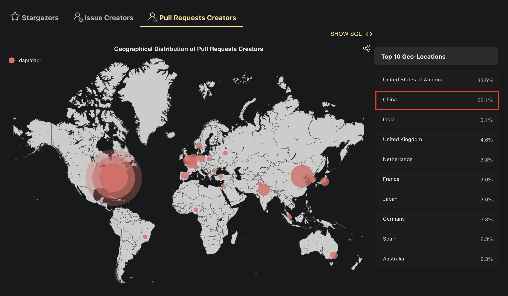

+++
title = "Dapr中国社区网站（预览版）发布！"
authors = ["aoxiaojian"]
date =  2022-07-14
draft = false

tags = ["社区建设"]
summary = "Dapr 中国社区 是一个以 Dapr 为中心的中立而开放的技术社区，为 Dapr 用户和开发者提供知识分享和经验交流的平台，由社区爱好者和志愿者发起和维护。"
abstract = "Dapr 中国社区 是一个以 Dapr 为中心的中立而开放的技术社区，为 Dapr 用户和开发者提供知识分享和经验交流的平台，由社区爱好者和志愿者发起和维护。"

[header]
image = ""
caption = ""

+++

## 社区介绍

Dapr 是一个可移植的、事件驱动的运行时，它使任何开发人员能够轻松构建出弹性的、无状态和有状态的应用程序，并可运行在云平台或边缘计算中。

Dapr 中国社区是一个以 Dapr 为中心的中立而开放的技术社区，为 Dapr 用户和开发者提供知识分享和经验交流的平台，由社区爱好者和志愿者发起和维护。

秉承"让 Dapr 用户和开发者更好的相互交流"的宗旨，两年前来自多个技术社区的 Dapr 爱好者共同组建了 Dapr 中国社区，并逐步发展成为被 Dapr 官方认可的社区组织。

在过去两年间，Dapr 中国社区组织了多种社区活动，如 Dapr 官方文档中文翻译，中国社区周会/双周会等。目前社区成员不断壮大，也涌现了非常多的 Dapr 贡献者和维护者。

分析数据显示，Dapr 26.2% 的 star 来自中国：

另外中国开发者贡献了 18% 的 issue ：

 和 22.1% 的 PR ：

 

> 数据来源：https://ossinsight.io/analyze/dapr/dapr

## 网站介绍

今天，继续秉承这一宗旨，为了"让 Dapr 用户和开发者更好的相互交流"，Dapr 中国社区在 Dapr 官方的大力支持下，推出了 Dapr 中国社区网站（预览版），并授权使用 cn.dapr.io 域名。您可以通过如下地址访问：

https://cn.dapr.io

网站内容密切围绕目前 dapr 中国社区最热门的内容，包括：

### 社区活动

汇聚最近 Dapr 相关的社区活动，包括线上分享，技术大会专题等。

通过这里大家可以快速了解近期将要到来的 Dapr 相关的社区活动或者技术分享，如正在筹备中的计划在8月底举办的 Dapr Day 活动。

也可以回顾之前的活动内容，获取相关的演讲PPT和视频回放，例如今年6月份备受瞩目访问量过百万的开源云原生开发者日活动：

### 博客分享

收集并整理来自 Dapr 社区的各种技术文档，包括原创文章和翻译文档，帮助大家快速获取最新的 Dapr 技术信息。

欢迎大家积极投稿，向社区分享你的知识，交流落地经验，和社区一起成长!

### 文档翻译

秉承 "让更多的人更轻松的使用 Dapr!" 的想法，Dapr 的中国早期爱好者（鸣谢 Justin 同学！）开启了 Dapr 官方文档中文翻译的工作，并一路坚持了两年。陆续参加过翻译活动的约有100人，目前翻译小组约有20位活跃成员，持续不断的在进行 Dapr 官方文档的翻译工作。

仅以此图，致敬过去两年中持续不断无私贡献的志愿者们：

在2022年，翻译小组翻译并发布了 Dapr 官方文档 v1.5版本，v1.6 版本目前接近完成预计下周发布。之后翻译小组将启动 v1.7 版本的翻译。值得一提的是，在 v1.7 版本中我们将攻克最后一个大关：reference 部分，从而在进度上完全追平 dapr 英文文档，覆盖所有内容。

Dapr 中文文档目前已经上线 Dapr 官方文档网站，您可以通过以下地址访问：

https://docs.dapr.io/zh-hans/

### 源码解读

为了对 Dapr 有更深刻的了解和掌握，Dapr 中国社区组织了 Dapr 源码解析活动，并于本周正式启动：

稍后源码解析小组将陆续将产出的内容以文章和视频会议的形式进行分享，欢迎关注，更欢迎一起参加！更多详细请访问如下地址：

https://cn.dapr.io/source/join/

### 社区双周会

2020年10月，Dapr 社区会议第一次举行，当时还是 Dapr SIG 的会议，每周举行，后来来自其他技术社区的 Dapr 爱好者也都陆续参加，进而发展成为 Dapr 中国社区的交流会议。

在这里鸣谢并致敬 Dapr 社区会议的发起者和长期维护者兼会议主持人 杨鼎睿 同学！

2021年底，在和 Dapr 官方沟通之后，中国社区的 Dapr 会议被升格为 Dapr 官方社区会议。在2022年7月，经过 Dapr STC 商议，Dapr 中国社区的双周会正式取代原 Dapr 社区亚太地区的社区会议。

Dapr 中国社区会议更多详细，包括历次会议的纪要和视频回放地址，请访问如下地址：

https://cn.dapr.io/meeting/

### 用户案例

在 Dapr 的官方网站上，有一个专栏介绍使用 Dapr 公司和落地场景：

随着 Dapr 在中国影响力的增加，Dapr 的用户也在增加，而社区对 Dapr 用户案例的分享需求更是持续增加。因此，应社区强烈要求，Dapr 中国社区网站开设了用户案例专栏，准备收集并整理 Dapr 的用户案例，并进行深度分享。

欢迎 Dapr 的实际用户提交并分享你们的落地实践，请访问如下地址：

https://cn.dapr.io/case/join/

### 出版物

这个栏目收集了 Dapr 相关的出版物，截止2022年7月，Dapr 总共有三本实体书和一本电子书：

- Introducing Distributed Application Runtime(Dapr)
- Practical Microservices with Dapr and .NET：中文翻译版本即将上市
- 面向 .NET 开发人员的 Dapr （电子版）
- Learning Dapr：已有中文翻译版本出版

### 社区成员

由于网站刚刚推出，暂时还是预览版本，因此目前只上线了少量的社区成员，后续将陆续补充：

## 总结和展望

作为一个新兴的开源项目，Dapr 在过去两年间得到了技术社区不少的关注，github 高达 18000 的 star 可以证明 Dapr 的关注度。但作为一个全新理念的云原生产品，Dapr 的知名度和接受程度依然远远不够，尤其是在落地实践上还非常欠缺。

因此，希望通过加强社区合作和交流，进一步扩大 Dapr 的技术影响力，并提升社区成员对 Dapr 的理解和掌握程度，发展更多的 Dapr 贡献者/维护者，建立起更完善的开源生态，并最终实现更多的 Dapr 落地，帮助更多的用户，切实解决云原生下分布式应用开发的痛点。

Dapr 中国社区网站是迈向这一目标微小而坚定的一步！

最后，欢迎大家收藏并经常访问 Dapr 中国社区网站（预览版）： 

https://cn.dapr.io/

