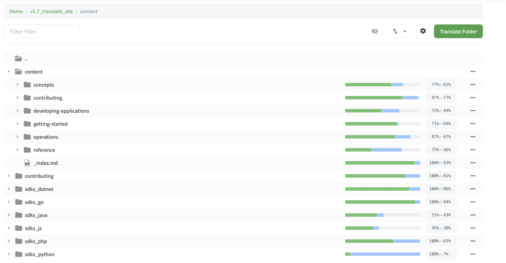

+++
title = "Dapr 官方文档中文翻译 v1.6 版本正式发布"
authors = ["aoxiaojian"]
date =  2022-07-20
lastmod = 2022-07-20
featured = false

tags = ["Dapr", "name resolution"]
summary = "Dapr 官方文档中文翻译 v1.6 版本发布，离推翻三座大山只剩不长的距离，我们离中英文文档保持同步的目标越来越近了。继续努力！"
abstract = "Dapr 官方文档中文翻译 v1.6 版本发布，离推翻三座大山只剩不长的距离，我们离中英文文档保持同步的目标越来越近了。继续努力！"

[header]
image = ""
caption = ""

+++

Dapr 中国社区文档翻译小组在本周将发布 Dapr 官方文档中文翻译 v1.6 版本，目前所有内容（除 reference 部分之外）都已经完成翻译和审校，即将上线 Dapr 官方网站。

我们骄傲的宣布：Dapr 官方文档中文翻译工作中的第二座大山已经被推翻！距离革命胜利为时不远啦！

### 何为三座大山？

在 Dapr 的官方文档中，有三个章节由于内容超级多，一直是 Dapr 中文文档翻译工作中最艰辛的部分，因工作量巨大被戏称为"三座大山"。在最近的 v1.5/v1.6 版本的翻译工作中，除了更新常规内容之外，重点在于完成这三大块内容的翻译。

在3月20号发布的 v1.5 版本中，"operations" 章节完成了翻译和审校，第一座大山被推翻。另外 "developing-applications" 章节翻译接近完成只待审校， "reference" 翻译过半。下图是当时 v1.5 发布的进展情况：

在最新发布的 v1.6 版本中，"developing-applications" 章节完成了翻译和审校，第二座大山被推翻。另外 "reference" 翻译完成只待审校。这是目前 crowdin 网站上显示的 v1.6 发布时的进展情况：

在接下来的 v1.7 版本的翻译过程中，翻译小组除了继续进行常规更新的翻译，也将集中力量完成 "reference" 部分的翻译和审校，将这最后一座大山推翻。

在 v1.7 版本之后，翻译小组将致力于在中英文文档之间保持同步，尽可能实现对英文文档增量部分的及时翻译，以保证中文文档的有效性和及时性。

### 特别鸣谢

Dapr 中国社区在去年底重组了中文文档翻译小组，重启了 Dapr 翻译文档的翻译工作，并在今年3月底发布了 v1.5 版本，以及这一次的 v1.6 版本。

以下是参与 Dapr 官方文档中文翻译 v1.6 版本翻译和审校的贡献者名单：

谢谢各位小伙伴的辛苦努力和无私奉献！

特别鸣谢 Mr.Black / Jadyn / w_Y_ 三位同学为此次发布做出的极大贡献！

### 欢迎加入

为了更好更快的达成目标，让 Dapr 可以更好的在中国技术社区推广，让英文不是特别好的部分同学可以更方便的查阅文档，我们真诚的希望有更多的社区朋友加入到 Dapr 的文档翻译工作中来。

Dapr v1.7 版本的翻译工作即将启动，新的征程，期待您的加入！

加入方式：

访问 https://cn.dapr.io/translation/ 了解详情

### 问答1: 为什么选择使用 crowdin 作为翻译工具？

这是一个经常被社区小伙伴们问及的问题：为什么选择使用 crowdin 作为翻译工具？

尤其是 crowdin 本身的使用需要了解一点背景知识，以及 crowdin 的操作方式和技巧，因此有一点的门槛。部分心急的小伙伴就曾提出问什么不用常规的方式：直接将整个文件翻译完成，然后以 PR 的方式提交。

以下是 Dapr 文档中 concepts 部分，在 v1.6 发布之际，翻译和审校的完成情况如下图所示，翻译完成度都是100%：

在 v1.7 版本中，我们更新了英文文档的内容，由于英文内容有了更新，因此 concepts 部分的翻译完成情况变成了这样：

可以看到有一部分文档的翻译完成情况依然是100%，表示这个文档在 v1.7 版本中没有变更，也即无须再次翻译。另外部分文档的翻译完成情况变成了69%/87%/36%，这表明这些文档的内容在 v1.7 版本中有了更新（包括新增和修改），因此完成度下降，需要继续补充这部分内容的翻译。

我们在 crowdin 中打开其中一个内容有更新显示完成度为69%的文件：

图中绿色部分表明这些内容没有更新，继续自动沿用上一个版本中的翻译。而粉色内容则表示这些内容是有更新，需要翻译人员介入进行翻译。

继续在 crowdin 中打开其中一个内容有更新显示完成度为87%的文件：

可以看到整个文档的内容都没有修改，只是增加了一小段文字和一段代码。

相信大家看到这里就能理解为什么我们会在 Dapr 的文档翻译中选择使用 crowdin 这样的工具来进行翻译内容管理，而不是简单的直接管理原始待翻译文件和翻译产物。

### 问答2: 文档翻译的工作量到底有多大？

这也是经常被问到的一个问题，答案很简单，有图有真相。

相对工作量：这是目前准备开工的 v1.7 的翻译情况，注意在 v1.6 中所有章节内容都是翻译完成度100%，而现在都有了不同程度的下降，体现为英文文档内容有了比较大的变更。比如三座大山中的 "developing-applications" 下降为 72%, "operations" 下降为87%，"reference" 下降为75%，差不多半座大山又回来了 ^0^

绝对工作量：这是过去一年中 crowdin 上面的统计情况。28位活跃成员累计完成了 37.8 万字数的翻译和 21.6 万字的审校。

文章最后再次感谢翻译小组可爱的小伙伴们！