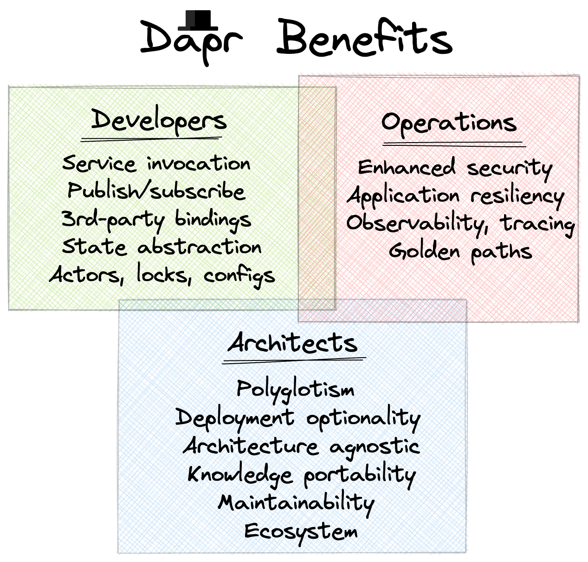

+++
title = "[译]Dapr 是一个“10倍好”平台"
authors = ["luoguangming"]
date =  2022-11-23
draft = false
featured = true

tags = []
summary = "伟大的技术在时机成熟时才会变得有用。Dapr 是多语言的微服务，是 API 驱动和声明式的，与云原生原则和操作实践一致。Dapr的好处与云原生生态系统的其他部分一起成倍增加。Dapr 是一个10倍好的技术，它的时代已经到来。"
abstract = "伟大的技术在时机成熟时才会变得有用。Dapr 是多语言的微服务，是 API 驱动和声明式的，与云原生原则和操作实践一致。Dapr的好处与云原生生态系统的其他部分一起成倍增加。Dapr 是一个10倍好的技术，它的时代已经到来。"

[header]
image = ""
caption = ""

+++

> 文章转载自: https://mp.weixin.qq.com/s/yoQcCm6cSv36VOz2VT3npA ，译者 罗广明。英文原文为 [Dapr as a 10x Platform](https://www.diagrid.io/blog/dapr-as-a-10x-platform)，作者 Bilgin Ibryam。

## 译者注

在正式阅读本文之前，我们有必要先了解下什么是“10 倍好”。

10 倍好理论最早出自彼得·蒂尔的《从 0 到 1》，他说**一个新创企业，要想获得快速成长，其提供的解决方案要比现有方案好 10 倍以上**，这个好 10 倍，可以是成本低 10 倍，效能强 10 倍，或易用性优 10 倍。

为什么 3 倍 5 倍不行，要好 10 倍呢？因为：**消费者会高估已有解决方案 3 倍以上，创业者会高估自己方案 3 倍以上，因此你要创造一个比现状好 10 倍的方案**。只要这样，客户才有动力，愿意挣脱现有方案的惯性，冒着风险去尝试你的方案。这就是 10 倍好理论，真正创新或颠覆性的产品和服务，至少要比目前做法好 10 倍才有可能成功。 

翻译本文的主要原因还是想借此深入了解 10 倍好理论，Dapr 只是一个载体。**这个思考框架，不但对初创企业有用，对于成熟的大公司开发新产品开拓新市场，都有很大帮助**。在整个云原生浪潮之下，Dapr 是否是一个 10 倍好平台？未来是否还可能出现其他 10 倍好的软件或者产品呢？

本文作者  Bilgin Ibryam 最近加入了开发者软件初创公司 Diagrid Inc，他是Apache Software Foundation 的 committer 和 member，前红帽架构师。他也是一个开源的布道师，曾在 2020 年初 提出的Multi-Runtime Microservices Architecture（多运行时微服务架构）。

## 正文

### 01 概述

**一个新想法要传播，一个项目要被广泛采用并成为主流，它必须至少比现状好 10 倍，以证明为改变所付出的努力是合理的**。微服务架构改进了大多数组织的发布周期，从每季度（12周）或更长到每周甚至更短。Docker 使得在一台主机上运行数十个服务而没有资源冲突成为可能，而不只是 10 个。Kubernetes 使运维人员能够维护 10 倍以上的服务。这些都是 10 倍改进的例子。但是，实施新想法和采用新技术也会带来成本和新的缺点。识别领域边界、实现网络弹性、定位问题、测试和运行微服务的成本是在单体架构中不存在的。学习 Kubernetes、习惯异步协调行为和调试问题都需要全新的技能和工具，这些都是成本。然而，这些新架构和工具对组织的整体价值的重要性证明了变革的痛苦都是有意义的。在这篇文章中，我们将探讨为什么 Dapr 是一个在正确的时间出现的 10 倍好的运行时，它为组织中的不同角色提供了什么好处，以及它的缺点是什么。

Dapr 给整个组织都带来了好处：

Dapr 提供了一种与传统基于 SDK 的方法不同的方法来使用集成特性。**Dapr是一个通过 sidecar 为分布式系统提供 API 的工具包**，这使它成为云原生应用程序的一个很好的解决方案，无论是新的绿地应用还是迁移现有的棕地应用。虽然 Dapr 主要用于开发人员构建应用，但它也改善了运行这些应用的运维人员的工作方式，同时也有益于试图使组织的应用和工具库井然有序的架构师的。让我们先看看 Dapr 为企业中的各种角色带来了什么好处，然后再看看使用它的成本。

### 02 给开发者带来的好处

开发人员有广泛的责任，从理解业务，创建新的应用，维护旧的应用，甚至在业务没有涉及到的领域进行创新。在本文中，我们主要关注开发人员如何创建新的分布式应用，并将它们交付到快速迭代的业务中。从这个角度来看，Dapr 可以在哪些方面显著地帮助开发者?

#### 服务调用

微服务是新应用的主要架构模式，服务间的同步通信是其核心。**Dapr 服务调用 API 可以帮助开发人员处理服务发现、服务间安全通信、请求超时、重试、负载均衡等问题**。

#### 发布与订阅

伴随微服务的另一个架构趋势是使用带有某种发布-订阅实现的事件驱动交互模型。**Dapr 提供了一个平台无关的 API 来发送和接收消息，该 API 通过可插入组件机制与各种消息 broker 和 queue 系统集成**。这支持跨本地和生产环境的可移植性，以及在提供不同发布-订阅和其他平台服务的不同云厂商上部署相同的应用程序。

#### 三方库集成

现代云原生应用的另一个必要性是与第三方服务和知名 API 的集成。**使用 Dapr 的 binding API，你可以用来自数十个外部系统的事件触发你的应用，并通过保持你的代码不受 SDK 的影响来与外部系统进行交互**。这使开发人员不必深入了解如何使用特定的 SDK 来连接到外部系统或从特定端点的故障中恢复。最终的结果是，开发人员可以专注于业务逻辑并创建可移植的应用，而无需在应用中使用特定环境或特定云平台提供程序的绑定。

#### 开发环境

为本地和共享的测试环境构造一个拟生产环境一直是一个挑战。其它的不说，它需要给应用添加配置、发现其他本地运行的服务、访问外部依赖项(如数据库、消息代理、云服务的本地代理)等。在拥有许多开发人员的大型组织中，创建专用测试环境的成本可能很高，而且必须共享其中的一些依赖项。**Dapr 的配置 API 允许开发人员使用配置并在配置项更改时订阅更改。Dapr 的服务调用 API 允许发现部署在本地或生产环境中的服务**。Dapr 的发布/订阅和状态 API 允许在不更改应用程序代码的情况下交换消息代理和状态存储。这样，开发人员就可以针对本地 Redis 代理进行开发，并仅通过配置将其替换为生产中的云服务。Dapr 还简化了多个开发人员之间共享消息代理和状态存储的过程。Dapr 可以充当基础开发者平台，允许多个团队创建可移植和多语言应用。

#### 其它

**Dapr 中还有其他功能可以提高开发人员的工作效率**，但这超出了本文的目的。Dapr 的状态管理 API 可以使用抽象状态存储执行 CRUD 操作；Dapr 参与者可以实现大量小的、独立的、隔离的状态和逻辑单元；其他原语（如分布式锁）可以提供对资源的互斥访问；在现有功能的基础上构建的新功能（如编排长时间运行的流程）也将出现。所有这些使得 Dapr 成为一个强大的分布式工具箱，很难被云原生开发人员忽视。

### 03 给运维者带来的好处

这是另一大类 IT 人员，就这个职位而言，它包括传统的运维团队、站点可靠性工程师，甚至是较新的平台工程师团队。所有的团队都不是在编写应用程序，而是保持应用的运行，并使开发人员能够更有效地完成工作。虽然 Dapr 主要是一个开发人员工具包，但一旦引入到应用程序中，它也会改善运营团队的工作。让我们看看 Dapr 是如何帮助大规模自动化和操作大量应用的。

#### 安全

安全是许多团队的责任，但在这里，我们将总结 Dapr 在应用安全方面帮助运维类团队的领域。

- Dapr 有一个专门的 secrets 构建块，允许开发者从 Azure Key Vault、Hashicorp Vault等 secrets 商店获取 secrets。最酷的是，这些 secrets 可以用于特定的应用程序，也可以用于其他 Dapr 组件，如状态存储、发布/订阅组件。

- 从网络的角度来看，Dapr 具有与服务网格重叠的功能。Dapr 有助于通过 mTLS 对服务实例之间的通信进行加密。Dapr 允许运维人员和开发人员自带证书，或者让 Dapr 自动创建和持久化自签名根证书和颁发者证书。

- mTLS 可以加密 sidecar 之间的流量，而 Dapr 支持 API 令牌身份验证，在应用程序和 sidecar 之间提供额外的安全级别。启用基于令牌的身份验证会导致 Dapr 和/或应用程序要求对其 API 的每个传入请求都包含一个身份验证令牌，然后才允许该请求通过。这种方法通过将代理到代理身份验证扩展到应用程序到应用程序，提供了真正的端到端服务调用安全性。

- Dapr OAuth 2.0 特性允许您在端点上启用 OAuth 授权，以便通过 Dapr 的任何方法调用在传递给用户代码之前都需要得到授权。这不需要编写任何额外的代码，除了中间件配置。

- Dapr 中的访问控制提供配置策略，限制调用应用的操作可以通过服务调用在被调用的应用程序上执行什么操作。要限制特定操作对被调用应用程序的访问，以及从调用应用程序（通过SPIFFE id）限制 HTTP verbs 对被调用应用程序的访问，可以在配置中定义访问控制策略规范。

- 在零信任的网络中，或通过前端将 Dapr 暴露给外部流量时，可以根据应用的实际需要调整 Dapr API 的作用域，减少攻击面。

- 根据其本质，Dapr sidecar 在业务逻辑和运行流程的基础架构代码之间创建了一个边界。将应用程序代码与基础架构代码分离，有助于识别漏洞的范围，并通过推出只涉及受影响部分的代码的新版本，帮助更快地进行补救。

如上所述，Dapr 的安全好处是多方面的，有些是显性的功能，有些是间接的好处，这要归功于它的 sidecar 架构。**Dapr 的非侵入性意味着你可以只使用你想要的功能，并将 Dapr 与其他类似的工具（如服务网格）结合起来**。

#### 弹性

**Dapr 为流行的弹性模式提供实现，如超时、重试/回退、熔断**。Dapr 的优点在于，这些模式不仅可以应用于执行服务调用的应用，还可以应用于 Dapr 组件。这意味着，除了内置的弹性特性外，与其他系统交互的组件还可以通过弹性模式从额外的容错中获益。

#### 可观测性

由于 Dapr 位于服务交互的请求路径上，并充当到其他系统的粘合剂，它**可以访问到丰富的应用 metrics、traces 和 logs 数据**，这是大多数其他框架所不能做到的。Dapr 中可观测性数据的主要来源如下。

- Dapr 公开了一个 Prometheus metrics 端点，您可以利用该端点更好地理解 Dapr 的行为，并为特定条件设置警报。

- Dapr 拦截所有应用程序流量，并自动注入相关 id 以跟踪分布式事务。由于 Dapr 不仅限于服务对服务的交互，它还可以通过各种协议和 API 跟踪和监视与外部系统的交互。它将 Zipkin 协议与 OpenTelemetry 收集器结合使用，用于分布式跟踪和度量收集，并支持许多开箱即用的后端，例如，Stackdriver、Zipkin、New Relic 等等。

- Dapr 数据平面 （sidecar）和控制平面（系统组件）都产生日志。此外，还可以启用 API 日志，它将记录所有出入 Dapr sidecar 的 API 调用，这对于理解应用程序的网络行为非常方便。

#### 黄金路径/Golden Paths

“黄金路径”一词是由 Spotify 的平台工程团队在 IT 领域引入的。它代表了通过“受祝福的”工具和过程来构建软件的一种武断的和内部支持的路径。这个想法并不是限制或阻碍开发人员，而是允许他们通过做出更少的决策和在日常活动中不重复工作来使用他们的生产力和创造力，以实现更高的目标。在实践中，这意味着为开发人员提供经过验证的、受支持的，即创造软件和其他常见任务的黄金路径。让我们来看看 Dapr 的哪些方面使其成为具有黄金路径的开发人员平台的基础。

- **Dapr 是一个多语言框架，具有 .Net、Python、Java、Go、PHP、Javascript、C++、Rust 的客户端 SDK**。但是 Dapr 并不一定要使用这些库，因为从设计上来说 Dapr 是多语言的，并且它可以通过 HTTP 被用任何语言编写的应用程序所使用。这使得 Dapr 不仅对使用 Java 或 .Net 的典型集成和中间件团队具有吸引力，而且对使用 Python 的数据工程师、Node 和 PHP 开发人员以及其他人员也具有吸引力。

- **Dapr 是一个多环境框架**。在本地运行、使用多租户特性在共享测试环境中运行或在生产环境中运行都很轻松。它即可以在本地运行，也可以在云端运行或在边缘运行。除了在不同的环境中运行之外，Dapr binding 还允许它连接到在不同环境中运行和变化的各种服务，而无需更改任何应用程序代码。

- **Dapr 是非侵入式的**。它不作为库包含在应用程序中，也不像服务网格那样拦截所有应用程序流量。因此，由您选择使用哪个构建块，并由您的应用程序决定何时与 Dapr API 交互。这使得 Dapr 功能只有在合理的情况下才可选择使用。

- **分离 Dapr 配置的关注点**。Dapr 功能作为构建块 API 向应用开发人员开放。但是这些构建块依赖于提供实现的组件。通常情况下，这些组件将由对平台和云基础设施具有较高权限的运营团队配置，并作为随时可用的方式提供给开发人员。这种分离允许运营指导，甚至控制开发人员可以使用哪些基础设施，哪些不可以。

所有这些特性使得 Dapr 作为组织内的基础平台在组织中非常具有吸引力。通常，这些功能作为黄金路径提供，并由平台工程团队集中自动化和管理。Dapr 足够通用，适合大多数团队，非侵入性，只在需要时使用，易于从平台团队集中管理和配置。

### 04 给架构师带来的好处

在其他事情中，架构师的角色是技术和业务之间的接口，并使用组合的知识使开发和运维团队朝着业务目标对齐。为了优化跨多个团队和时代的技术、人员和流程，单个开发人员可能不知道这些。有了架构师角色的定义，让我们看看 Dapr 可以帮助解决哪些架构方面的问题。

#### 多语言支持

如果您是一个团队中的开发人员，您可能已经掌握了一种编程语言，非常了解它的依赖库和工具生态系统，并且不受组织中其他团队每天使用的东西的影响。如果您是一个与多个团队打交道的企业级架构师，从事多个项目，并且您的工作时间范围比项目的长度还要长，那么情况就不同了。要设计一个解决方案，您必须知道团队正在使用什么语言、可用的框架、他们提供什么功能、他们的许可、生命周期、支持等等。另一方面，**Dapr 被设计成多语言，它不会对使用的语言做任何假设。这使得所有 Dapr 构建模块、组件和模式都可以在相同的条款下向所有人开放**。虽然这在短期内对单个开发人员或团队来说可能不是一个重要的特征，但从组织层面和更长的时间框架来看，这是非常重要的。

#### 部署选择多样化

如今，多云并不是美好的最终目标，而是许多架构师不得不面对的丑陋现实。许多组织既有部署在内部的软件，也有一个或多个云提供商提供的平台。这有时是为了从某些业务安排、特定的云特性中获益，有时是由于收购或影子 IT 而偶然发生的。无论出于什么原因，能够在不同的环境中运行应用，甚至拥有迁移的选项都是可取的。有时在设计解决方案的早期阶段以及在采购和确认最终环境之前需要这种可选性，有时在后期作为备份选项。设计解决方案的架构师与在实现期间已经拥有可用环境的开发人员相比，在头脑中会有不同的时间框架和不同的假设。**Dapr 被设计为在 Kubernetes 上运行最好，但它也可以在虚拟机、云或边缘上运行**。它具有可以连接到不同云服务的绑定，无论您的应用程序在哪里运行。所有这些使得 Dapr 成为通用模式和连接器的可移植实现，为架构师设计跨环境和实现可移植性的解决方案提供了一个公共基础。

#### 知识可迁移

技术的可移植性中很少提及的一个方面是知识和人的可移植性。例如，在一个新项目中使用 Java 并不是因为它的字节码可以移植到多个操作系统上，而是因为它的 JVM 是可靠的，而且当核心开发人员离开时，有数百万的开发人员可以雇佣。使用 Hibernate （它是一个 ORM 框架）不是为了与另一个数据库交换数据库，而是因为它有一个经过多年验证的实现，它有众所周知的模式和编程模型，您可以找到一个知道它如何工作的开发人员。人们使用 Kubernetes 并不是因为 Kubernetes 可以移植到不同的云提供商，而是因为所有的运维知识和实践都可以从一个云提供商移植到另一个云提供商，并由同一个运维团队在内部应用。只有在与重用知识相结合的情况下，重用代码才是有效的。这和 Dapr 的想法是一样的。**Dapr 提供了可移植到不同团队和环境的公共连接器、模式和分布式系统原语的实现。它是迄今为止创建的最非侵入性、可移植的分布式系统工具包**。一旦学习了，同样的开发、运维和架构知识就可以移植到组织的各个部分，并应用到各种项目中。

#### 可维护

维护是更改和更新软件以跟上新需求、修复bug、优化性能等的过程。它是软件生命周期中分散的一个方面，这使得在新项目的早期阶段考虑它不那么重要，但从长期来看，它可能成为最昂贵的阶段。拥有一个易于维护性的平台是具有长远眼光的架构师所欣赏的加分项。Dapr 的哪些方面有助于软件维护?

- 更少的依赖：无论使用哪种语言，**Dapr 都提供了到广泛的外部系统的连接器，从而减少了项目中的第三方库依赖**。这意味着在本地存储库、工件存储库和容器注册中缓存的库更少。这意味着跨项目跟踪更新、安全修复和许可影响的库更少。这意味着对项目时间规划和预算的外部影响更小。

- 基于 API 的依赖：Dapr 也是一个外部依赖，但它作为一个独立的进程运行，通过定义良好的 API 和版本控制策略来访问它。因此，**您可以通过更新 Dapr 版本和重新启动您的应用程序 Pod 来应用 Dapr 安全补丁**。这意味着开发团队不必更改应用程序的依赖关系、测试它、构建它、创建容器等等（当然，除非使用了 Dapr 客户端库，并且 bug 在客户端库中，而您正在更新客户端库）。这意味着开发团队不必为了应用紧急修复程序或定期升级到外部依赖的最新版本而停止对某个特性的工作。Dapr 升级可以由平台工程团队执行，并作为一个通用基础提供给开发人员，他们可以通过一个稳定的 API 使用它，就像云服务一般。

- 声明性和配置驱动：**Dapr 功能通过 HTTP 和 gRPC API 公开，但 Dapr 配置了类似 Kubernetes 的声明式 API**。事实上，无论您是否在 Kubernetes 中使用 Dapr, Dapr 配置文件都是一个 Kubernetes CRD。声明性 API 更容易理解和维护，并且允许您通过用于其他云原生项目的相同自动化工具和实践来配置和调优 Dapr。

- 关注点分离：**使用 Dapr 可以创建松散耦合的应用程序组件，这些组件可以很容易地交换并连接到它们的软件环境**。注意，这也是六边形架构的定义，Dapr 很适合这种定义。在使用 Dapr 时，技术集成职责集中在 Dapr 中，业务逻辑封装在应用层中。这提供了与六边形体系结构相同的好处，例如延迟和更改技术决策，在隔离外部系统的情况下测试和更改业务逻辑。

#### 生态系统的一部分

**当微服务是占主导地位的绿地应用架构、开源是占主导地位的开发模型、开放标准是占主导地位的创新和采用模型时，Dapr 就出现了**。因此，我们看到 Docker 和 Kubernetes 等新技术的采用速度最快。我们看到了诸如 Prometheus、Zipkin、Jaeger、Fluentd 等互补技术的不断增长，以及由此产生的诸如 OpenTelemetry、W3C Trace Context、Kubernetes API、CloudEvents 等开放标准。**作为 CNCF 的一个孵化项目，Dapr 建立在与 Kubernetes 相同的云原生原则之上，它有利于与其他云原生项目互补，为终端用户带来复合的业务价值**。虽然 sidecar 早在 Kubernetes 之前就已经存在了，但是现在的行业已经发展到更好地理解这种架构，并且能够更好地使用和操作这种编程模型。

### 05 Dapr 的缺点

消极工程是一个术语，用来描述做主要工作时必须做的前提工作。例如，采用微服务之前你需要考虑并处理网络错误。为了使用 Kubernetes，你需要学习分布式系统，并使用YAML编写代码....如果以上所有的例子都说明了为什么 Dapr 是一个 10x 框架，以及它如何积极地帮助各种角色，那么使用 Dapr 的缺点是什么？以下是一些最常被指出的 Dapr 的缺点。

#### 逻辑上的复杂性

**采用 Dapr 的最大挑战之一是多个移动部件带来的复杂性增加**。我之所以说它是可感知的，是因为如果你在做微服务，你已经在处理分布式系统和操作多个进程了。与 Dapr 的交互并没有什么不同，只是 Dapr 恰好在您的每个服务本地运行。Dapr 不透明地修改任何应用程序网络规则，也不像服务网格那样拦截到服务的所有网络流量。Dapr 是一个技术组件，它为你的服务提供了一个可供交互的 API，并且它通过定义良好的 API 与你的应用交互。虽然这是一种新的范式，需要勇气开始，并通过实践来适应，但今天的开发和运维工具对运行和操作 sidecar 有很大的帮助。

#### 网络延迟

如果低延迟是一个应用的关键需求，那么运行在 Kubernetes 上的基于商业云基础设施的微服务可能不是正确的起始架构。为了获得最佳性能，最好使用在专用硬件或大型机上运行的单体应用。让我们假设情况并非如此，但您仍然希望在 Kubernetes 上运行低延迟的分布式应用程序。**由于额外的网络跳转而增加的网络延迟是基于代理的技术（如 Dapr）的常见副作用**。众所周知，Dapr 将为 90% 到 99% 的请求增加大约1到2毫秒的延迟，这比其他类似的基于侧车的服务网格要低。而且，由于 Dapr 不会拦截所有进出应用程序范围的流量，所以您可以控制何时使用 Dapr 并增加额外的延迟。很有可能，并不是应用程序中的所有微服务都对延迟敏感。甚至，并不是所有的服务端点都对延迟的轻微增加敏感。您可以在应用的边缘使用 Dapr 来与其他不可避免的额外延迟的系统集成。您可以使用 Dapr 进行大多数服务和数据源交互，并使用本机驱动程序、二进制协议等与对延迟敏感的系统交互。**Dapr 是一个非侵入的、可选择加入的工具集合，只能在有意义的地方使用**。

#### 资源消耗

**当部署在 Kubernetes 上时，Dapr 有一个需要额外资源的控制平面。数据平面 sidecar 还需要与应用实例成比例的额外容量**。但是 Dapr 是用 Go 语言编写的，占用空间小。它使用 gRPC 协议进行更有效的 sidecar 对 sidecar 通信。而且大多数 Dapr 作业都是网络绑定，资源消耗很少。是的，Dapr 需要额外的资源，但它的性能消耗和资源消耗都很低，而且可以持续测量和控制。

#### 调试与测试成本

使用 Dapr 将把所有的外部集成移到应用程序外部，并帮助您提高业务逻辑的可测试性。**但是额外的跳跃会使集成和端到端测试更加复杂，发现问题也更加困难**。也就是说，调试基于容器的应用的工具和 Kubernetes 工作负载每天都在改进，包括为 VS Code 等 IDE 安装的 Dapr 插件。

### 06 总结

Dapr 是一个具有多方面好处的开发框架。其开箱即用的特性帮助开发人员集成服务，并以声明的方式与第三方系统连接。一旦引入到应用环境中，Dapr 就可以帮助运维团队实现更好的可观察性，提高安全性和可靠性。对于那些希望为企业中的每个团队提供受控开发能力的平台工程师来说，Dapr 是一个基础。Dapr 的创始人正在 Kubernetes 上提供一个名为 [Diagrid Conductor ](https://diagrid.io/conductor) 的管理 Dapr 的 SaaS。

然而，仅仅 10 倍的好处是不够的。一个想法要实现，就必须是及时的。正如维克多·雨果曾经说过的：“**Nothing is as powerful as an idea whose time has come**（没有什么比时机成熟的思想更有力量）”。**微服务架构和原生云技术如此迅速地成为主流，是因为硬件创新支持廉价的云计算，同时也因为业务有了快速改变的需求以适应时代**。简而言之，伟大的技术在时机成熟时才会变得有用。Dapr 是多语言的微服务，它像 Docker 一样便携，它像 Kubernetes 一样可以组合使用。**Dapr 是 API 驱动和声明式的，与云原生原则和操作实践一致**。它是及时的，并且自然地补充了其他云原生项目。它的好处与云原生生态系统的其他部分一起成倍增加。Dapr 是一个10倍好的技术，它的时代已经到来。

