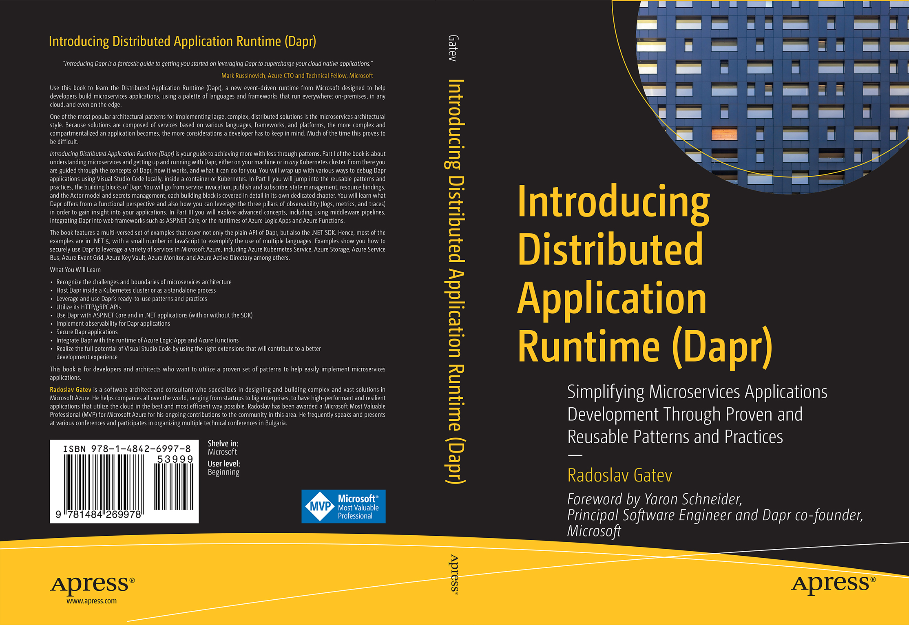

## 书籍介绍

书名：Introducing Distributed Application Runtime (Dapr): Simplifying Microservices Applications Development Through Proven and Reusable Patterns and Practices 1st ed. Edition

中文书名：分布式应用运行时（Dapr）介绍：通过成熟和可重复使用的模式和实践简化微服务应用开发（第1版）

作者：Radoslav Gatev

ISBN-13: 978-1484269978

ISBN-10: 1484269977

- Explains how to achieve more with less by leveraging the proven and repeatable models and patterns that Dapr offers
- Covers interfacing with external systems (self-hosted, PaaS, or SaaS offerings) without bloating the code with any third-party SDKs or incorporating any external paradigms
- Presents a comprehensive view on important, yet often neglected, concepts such as observability and security

## 配套的源码

https://github.com/Apress/introducing-dapr
