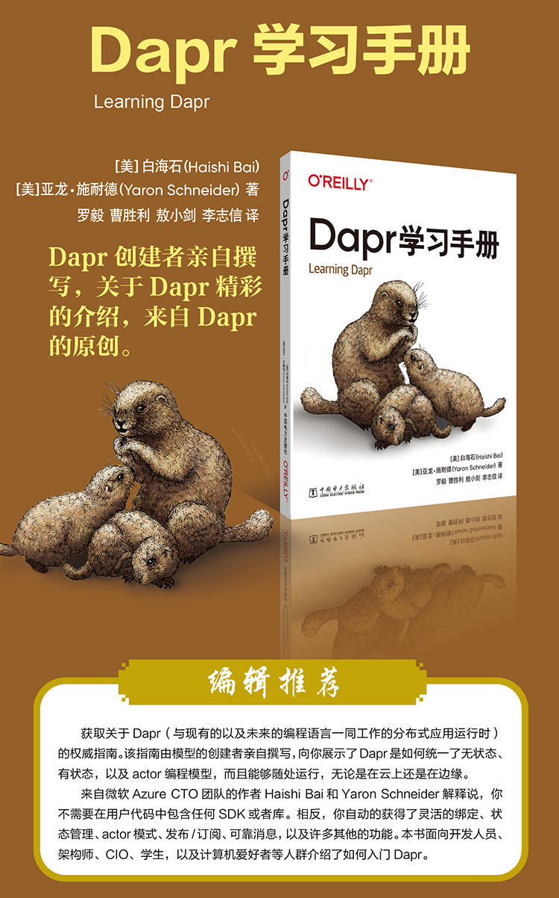
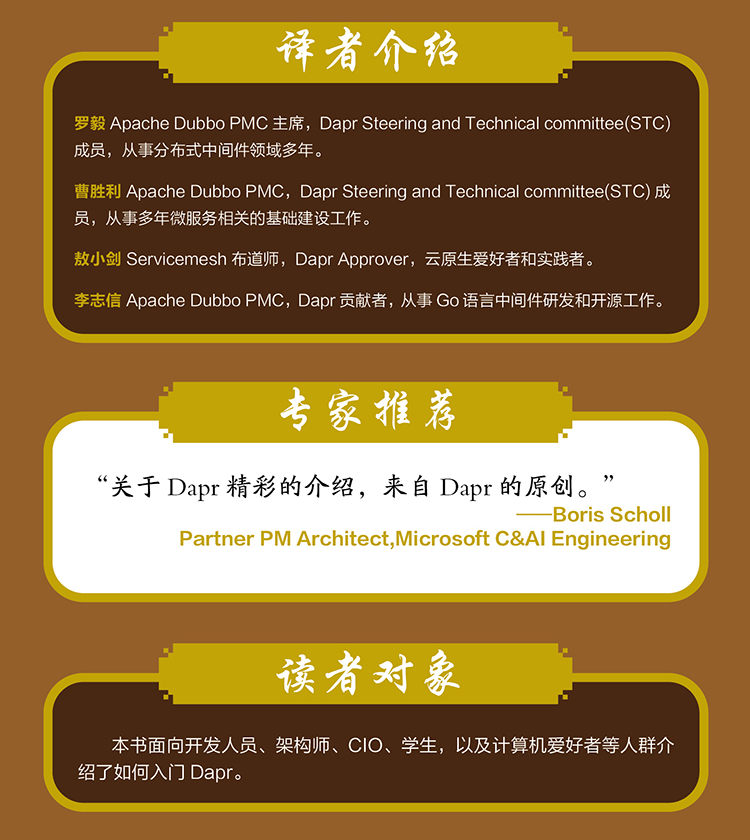
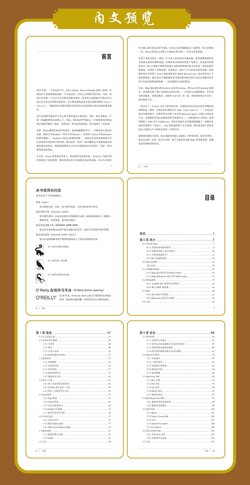
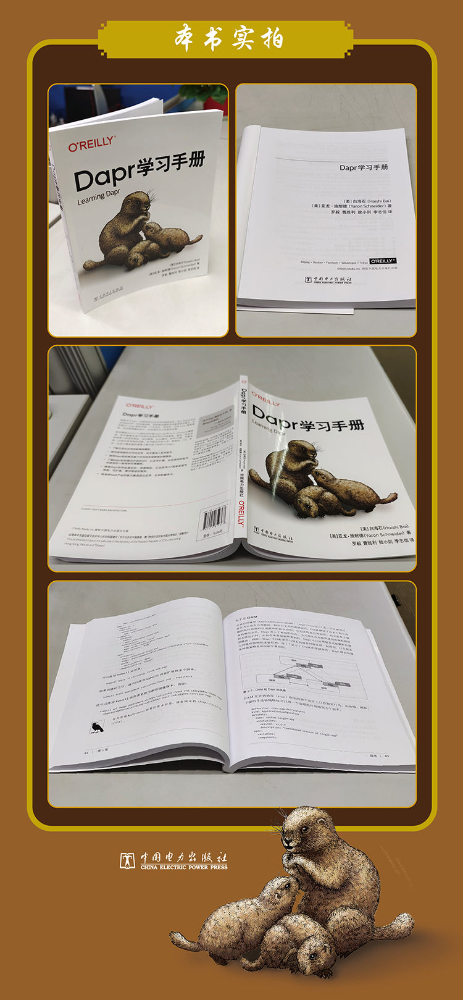
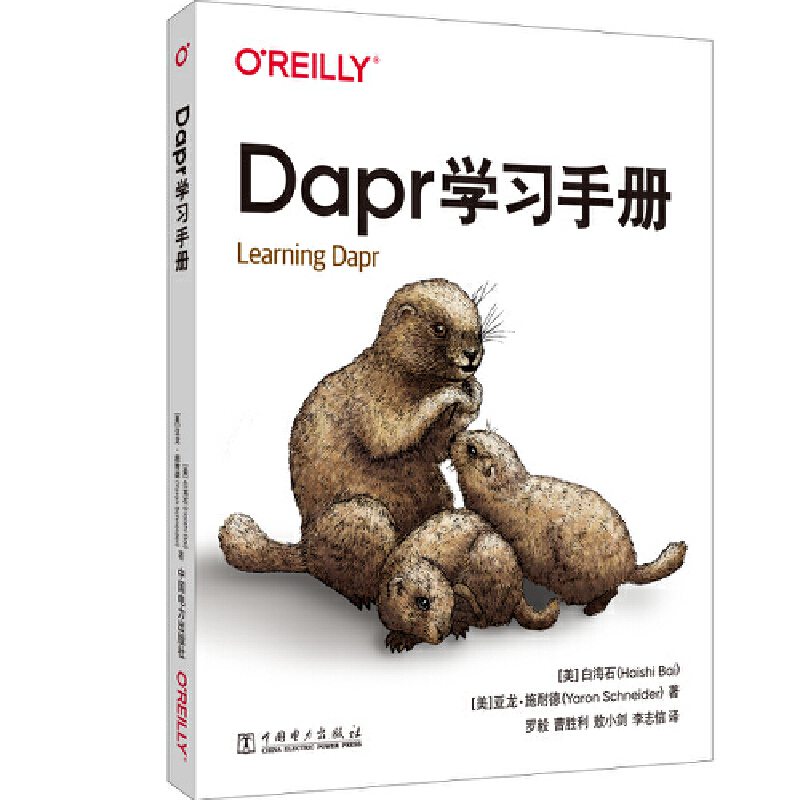

## 书籍内容

- 了解云原生应用的新编程模型。
- 编写高性能的分布式应用，而无需深入技术细节。
- 使用Dapr轻松编写基于任何语言或框架的微服务。
- 了解Dapr如何通过开放的API，以及可扩展、社区驱动的组件来提供的一致性和可移植性。
- 探索Dapr如何处理状态、资源绑定、以及发布/订阅来实现可伸缩、可扩展、事件驱动的架构。
- 将各种SaaS产品的能力集成进云应用，比如机器学习。

## 作者简介

- Haishi Bai是一位经验丰富的开发人员和架构师，拥有30多年的编程经验。他作为Microsoft Azure CTO办公室的成员领导了一系列云创新项目。同时他还是一位热情的教育家，出版了八本云计算相关书籍。

- Yaron Schneider是Microsoft Azure CTO团队的首席软件工程师。他是一位狂热的开源倡导者和贡献者，主要致力于云原生技术。Yaron是KEDA（CNCF项目）和Osiris的原创作者之一。

## 译者介绍

- 罗毅 Apache Dubbo PMC主席，Dapr Steering and Technical committee(STC)成员，从事分布式中间件领域多年。
- 曹胜利 Apache Dubbo PMC，Dapr Steering and Technical committee(STC)成员，从事多年微服务相关的基础建设工作。
- 敖小剑 Servicemesh布道师，Dapr Approver，云原生爱好者和实践者。
- 李志信 Apache Dubbo PMC，Dapr贡献者，从事Go语言中间件研发和开源工作。

## 编辑推荐

获取关于Dapr（与现有的以及未来的编程语言一同工作的分布式应用运行时）的权威指南。该指南由模型的创建者亲自撰写，向你展示了Dapr是如何统一了无状态、有状态，以及actor编程模型，而且能够随处运行，无论是在云上还是在边缘。

来自微软Azure CTO团队的作者Haishi Bai和Yaron Schneider解释说，你不需要在用户代码中包含任何SDK或者库。相反，你自动的获得了灵活的绑定、状态管理、actor模式、发布/订阅、可靠消息，以及许多其他的功能。本书面向开发人员、架构师、CIO、学生，以及计算机爱好者等人群介绍了如何入门Dapr.

## 书籍介绍

2018 年秋，一个阴沉的下午，Boris Scholl、Yaron Schneider 和我（海石）在微软位于雷德蒙德校园的一个小电话室，讨论云应用程序的开发。当时，我们正在构想一个与平台无关的应用程序模型，使开发人员能独立于特定平台设计出分布式应用程序的拓扑。这个想法终成为开放应用程序模型（ https://oam.dev ），该模型将应用程序描述为在软件定义的网格上相互连通的服务集合。

这个应用程序模型并不关心每个服务是怎么编写的。当时，我认为提出一个统一的编程模型太有野心了。因此，我们试图严格定义一个将服务视为黑盒的应用程序模型。然而，当我们进一步讨论该想法时，似乎遗漏了一些东西。突然，Yaron 跳到白板前开始涂画。通过他模糊的书写，一个绝妙的主意浮出水面，他称之为Reaktive（带有k 的Reactive，这反映了 Yaron 对 Kubernetes的深厚感情）。 Reaktive 的核心思想很简单——通过边车容器或进程将分布式系统构件带给用户的代码。我们将在“简介”部分解释这个优雅而强大的想法是如何将这一新颖的思想带入分布式系统的设计和实现中。现在，我们继续故事的讲述。

几天后，Yaron 带着原型回来了，我们都认为这很厉害。 Reaktive 为用户的代码带来了状态管理、服务发现以及与可靠消息传递等功能，并且不会用任何 SDK 或库来污染用户代码。它可以与任何编程语言一起使用（为了证明这一点，Yaron 甚至在之后做了 COBOL 的示例），并且它非常轻量。

在接下来的几周中，我们三个人花了很多时间头脑风暴，添加或删除我们认为有意义或没必要的功能，在微软更大的技术场景下考量它，以及思考如何发布它。Boris 邀请了微软和其他公司的架构师和开发人员来进一步验证我们的想法，并获得了早期反馈。总体而言，我们三个人的方向似乎没错，因此我们将它介绍给了 Azure 的首席技术官 Mark Russinovich，他立刻喜欢上了我们的想法。他认为这个编程模型有可能对框架设计和分布式应用程序的开发产生深远和普遍的影响——这远超我们之前的想法。

后来，Mark 提议我们将 Reaktive 改名为 Actions，即 Actor 和 Functions 的组合。该名称反映了新产品的核心价值主张：一个非侵入式编程模型，并且将无状态服务、有状态服务、函数和 actor 统一在一起。我们都喜欢这个名字，所以保留了它。

一年过去了，Actions 经过了数月的开发、大量的讨论以及来自很多早期尝试者的验证。终，它准备好以新的名字 Dapr（https://dapr.io）—— 分布式应用运行时的缩写，在佛罗里达州奥兰多市的 Microsoft Ignite 主讲台上被公布于众。这是微软有史以来成功的开源项目之一。在初的24 小时内，该项目收集了 1000 多个 GitHub star，并且在短短几天内增速就超越了一些受欢迎的开源项目（见图1）。Star 的热度持续了几个星期，团队成员终于厌倦并停止了每隔几个小时就去检查一下的行为。

很快我们就疲于奔命，社区贡献从四面八方涌来：合作伙伴的、竞争对手的、知名企业的，以及一些小公司的，每个人都在努力使 Dapr 变得更有用。这确实是开源好的地方。

巧合的是，O’Reilly 的 Kathleen Carr 通过 LinkedIn 联系上了我，询问我是否有出书的想法。 我提出了写《Actions in Action》这本书的想法。 这是一个大胆的提议：写一些仍在酝酿中的东西。Kathleen 依然很喜欢这个主意。几周后，我们签署了一份合同，将这本介绍 Actions （现在叫 Dapr）的书籍带给大家。

你正在阅读本书的事实证明了冒险是值得的。无论 Dapr 未来发生什么，你都在这里，我们也很高兴你在这里。

资源：

- Dapr 主页 (https://dapr.io)。
- Dapr 运行时仓库 (https://oreil.ly/SRqme)。
- Dapr 文档仓库 (https://oreil.ly/MlQfS)。
- Dapr 示例仓库 (https://oreil.ly/7JBHH)。
- Dapr 组件贡献仓库 (https://oreil.ly/lVk5V)。










## 内容预览




```yaml
目录
前言 
第0 章 简介 
0.1 什么是 Dapr
0.1.1 异构环境的编程模型
0.1.2 更多的帮助，更少的倾向 
0.1.3 不要重复造轮子！ 
0.1.4 统一的编程模型 
0.2 Dapr 的架构 
语言支持 
0.3 开始使用 Dapr 
0.3.1 Dapr 独立模式下的 Hello world ！ 
0.3.2 Dapr Kubernetes 模式下的 Hello world 
0.4 使用 gRPC 
0.4.1 从 gRPC 客户端调用应用程序 
0.4.2 编写 gRPC 服务器 
0.5 绑定 
0.5.1 独立模式下的绑定 
0.5.2 Kubernetes 模式下的绑定
0.6 小结
第1 章 服务
1.1 在云出现之前
1.2 云的承诺与挑战
1.2.1 可用性
1.2.2 弹性
1.2.3 云原生应用
1.2.4 基础设施是乏味的
1.3 服务调用
1.3.1 名称解析
1.3.2 请求和应答
1.3.3 并发控制
1.3.4 服务调用练习
1.3.5 通用命名空间
1.4 发布/订阅
1.4.1 基于消息的集成的好处
1.4.2 用Dapr 进行发布/订阅
1.4.3 发布/ 订阅的工作方式
1.5 Dapr 组件
1.5.1 Dapr 配置
1.5.2 自定义管道
1.5.3 自定义管道练习
1.5.4 OAuth 2.0 授权
1.5.5 编写自定义中间件
1.6 分布式追踪
1.6.1 追踪中间件
1.6.2 使用Zipkin 追踪
1.6.3 使用Azure Monitor 跟踪
1.7 服务运维
1.7.1 服务部署与升级
1.7.2 OAM
1.8 小结
第2 章 状态
2.1 状态管理
2.1.1 无状态与有状态
2.1.2 为什么无状态服务在云端更受欢迎？
2.1.3 托管有状态服务的挑战
2.1.4 将有状态服务转换为无状态服务
2.2 Dapr 状态管理
2.2.1 并发模型
2.2.2 一致性模型
2.2.3 批量操作和事务
2.2.4 多状态存储
2.2.5 重试策略
2.3 Dapr State API
2.3.1 Key 方案
2.3.2 Get 请求
2.3.3 Set 请求
2.3.4 Delete 请求
2.3.5 事务性请求
2.4 使用Dapr State API
2.4.1 数据处理的考虑因素
2.4.2 数据查询和聚合
2.5 状态存储
2.5.1 Redis 
2.5.2 Azure Cosmos DB 
2.5.3 etcd 
2.5.4 Apache Cassandra 
2.5.5 Couchbase 
2.6 自定义状态存储 
2.6.1 实现 State API 
2.6.2 更新组件注册表 
2.7 小结 
第3 章 消息 
3.1 事件驱动编程 
3.1.1 消息与事件的对比 
3.1.2 输入绑定和输出绑定 
3.1.3 Pub/Sub 
3.2 Pub/Sub with Dapr 
3.2.1 实现 Powershell 脚本 
3.2.2 使用Dapr CLI 测试发布/ 订阅 
3.2.3 Dapr 发布/ 订阅行为 
3.2.4 扩展 Dapr Pub/Sub 
3.3 使用Dapr 进行输入和输出绑定 
3.3.1 使用输入绑定 
3.3.2 使用输出绑定 
3.3.3 实现输入绑定 
3.3.4 实现输出绑定 
3.3.5 使用KEDA 自动缩放 
3.4 消息传递模式 
3.4.1 Saga 模式 
3.4.2 基于内容的路由 
3.4.3 路由清单 
3.4.4 智能代理 
3.4.5 MapReduce 
3.5 小结 
第4 章 安全 
4.1 保护分布式应用程序 
4.1.1 访问控制 
4.1.2 数据保护 
4.1.3 安全通信 
4.1.4 入侵与异常检测 
4.2 Dapr 安全功能 
4.2.1 密钥存储 
4.2.2 实现密钥存储 
4.2.3 Secret API 
4.2.4 Mutual TLS (mTLS) 
4.2.5 Dapr mTLS
4.3 小结 
第5 章 Actor
5.1 Actor 模式 
5.1.1 现代 Actor 框架
5.1.2 Actor 模型的误用 
5.2 Dapr 与 Actor 
5.2.1 调用一个 Dapr Actor 
5.2.2 状态管理 
5.2.3 计时器 
5.2.4 Reminder 
5.3 开始使用 Dapr Actors for C# 
5.3.1 定义 Actor 接口 
5.3.2 实现 Actor 接口 
5.4 小结 . 173
第6 章 应用模式 
6.1 云原生应用 
6.1.1 云上环境 
6.1.2 基于 Dapr 的云原生应用 
6.2 使用 Dapr 进行系统集成 
6.2.1 使用分布式工作流构建有限状态机 
6.2.2 同步 
6.3 更大生态系统中的 Dapr 
6.3.1 Yeoman Dapr 生成器 
6.3.2 在 Visual Studio Code 中使用 Dapr 
6.3.3 在 ASP.NET Core 中使用 Dapr 
6.3.4 更大应用中的 Dapr 
6.3.5 Dapr 和服务网格 
6.4 边缘场景中的 Dapr
6.5 小结
第7 章 Dapr 的未来
7.1 能力交付
7.1.1 架构
7.1.2 应用场景
7.2 增强的 Actor
7.2.1 聚合器
7.2.2 查询接口
7.2.3 Actor 图 
7.2.4 多版本 Actor 
7.2.5 Actor 中间件 
7.3 通用命名空间 
7.3.1 架构 
7.3.2 应用场景 
7.4 边缘场景中的 Dapr 
7.4.1 作为轻量级函数运行时的 Dapr 
7.4.2 WebAssembly 中的 Dapr 
7.4.3 作为脚本的 Dapr 
7.5 Dapr 的其他改进 
7.5.1 Dapr 组件投影 
7.5.2 实践和经过验证的模式 
7.5.3 Dapr 描述符 
7.5.4 Dapr 对多方计算的促进 
7.6 小结 
```


