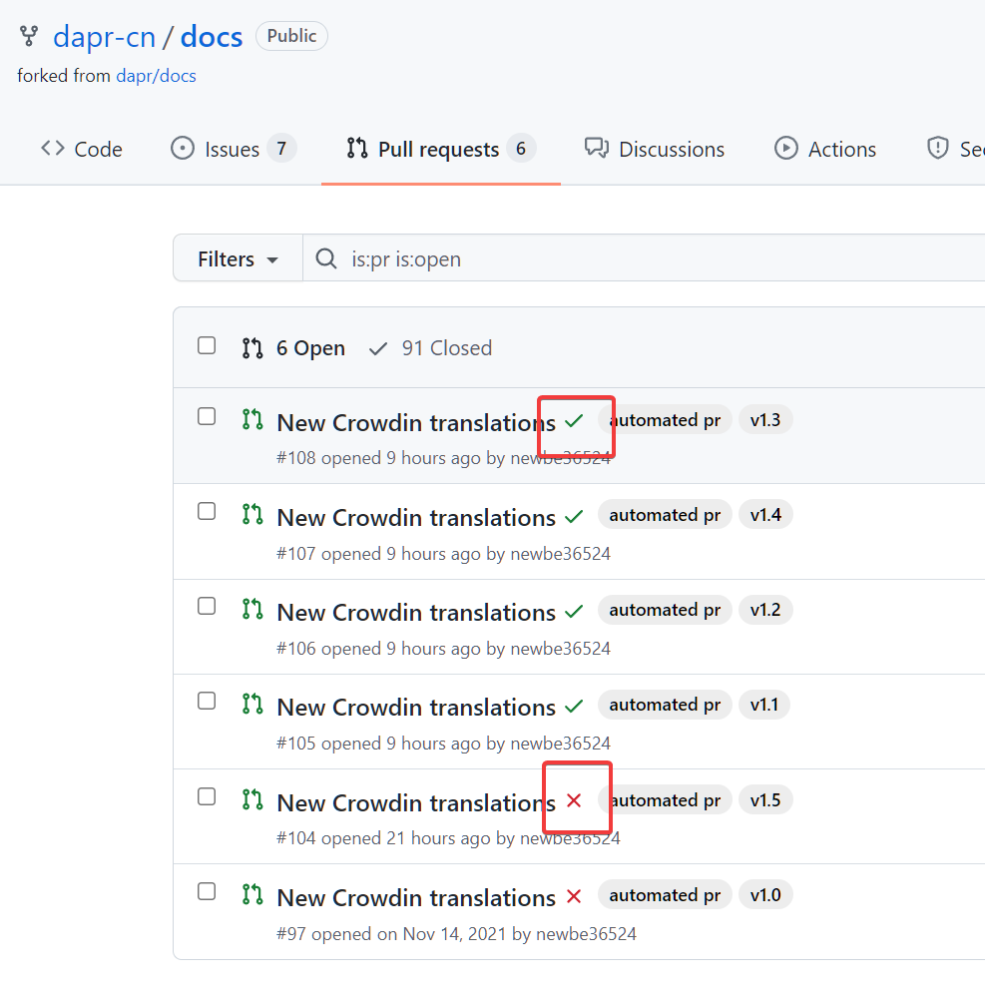
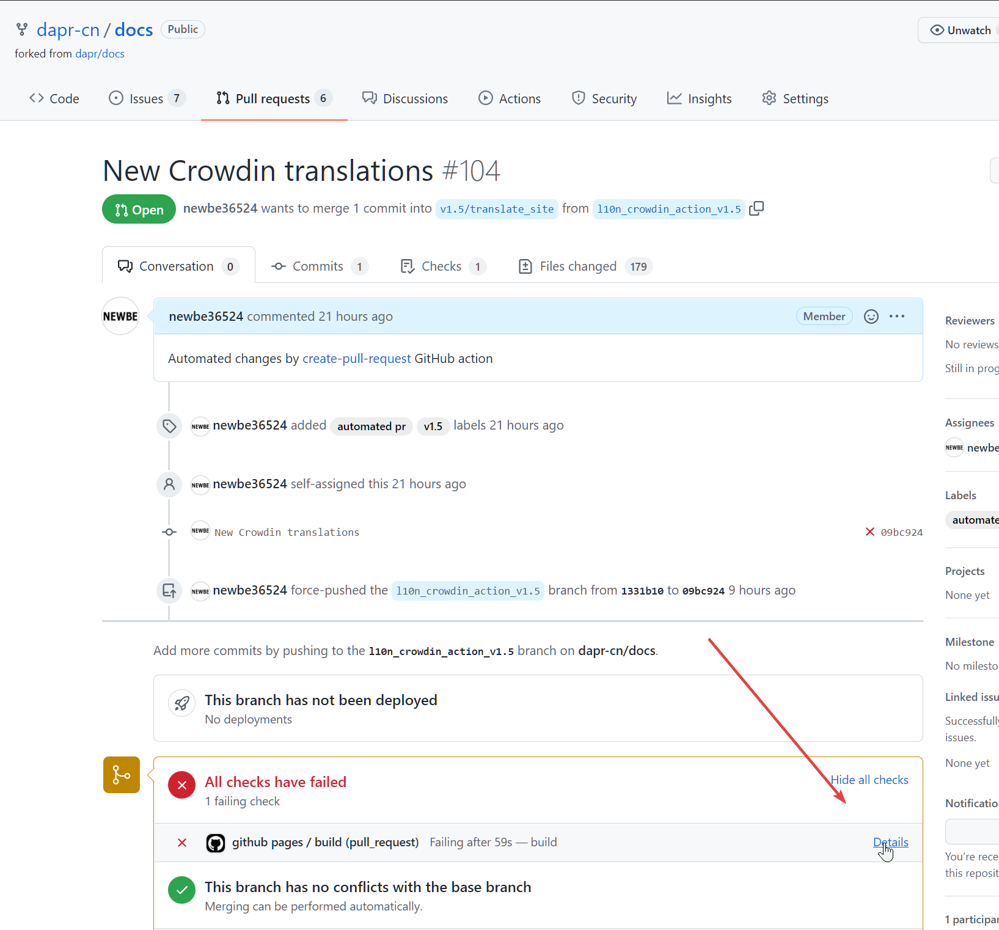

## 概述

Dapr 中国社区翻译小组正在组织翻译 Dapr 官方文档：

https://docs.dapr.io/

翻译完成的内容可以在官方网站访问，请在 Dapr 官方文档页面选择"简体中文"，或直接访问：

https://docs.dapr.io/zh-hans/

## 介绍

Dapr 中国社区翻译小组是服务于 https://docs.dapr.io/ 的文档简体中文内容的译制维护小组。

我们由许多热心、开朗和积极的成员组成，是一个开放，自由，非盈利的社区小组。

我们的宗旨是为 dapr 中文用户提供更好的文档体验及更好的交流体验。

如果你想要：

- 反馈文档简体中文翻译内容的建议和意见
- 参与内容翻译的维护
- 了解我们如何收集和维护文档的中文翻译内容
- 学习如何使用流程来维护外文的翻译内容
- 资助译制小组，促进小组健康发展
- 进一步走进 dapr 中国社区

那么，你来对地方了！

## 了解角色与贡献

本篇我们了解整个翻译过程的协作内容，以便你作为合适的参与者，参加到整个流程中来。

### 总体过程

整个流程可以分为吸纳变更、翻译内容和提交结果三个部分。详细一点又可以使用以下几步进行说明：

1. 将需要翻译的内容同步到 crowdin
2. 翻译 crowdin 中的内容
3. 将 crowdin 中的内容下载的 dapr-cn/docs
4. 将内容同步到 dapr/docs-zh
5. 更新 dapr/docs submodule

下面，我们按照不同的参与角色对特定的工作进行说明，你可以选择你感兴趣的内容进行参与。

### 作为译制员

这是参与本小组最为简单的一种方式。

你的责任是：

1. 参与 crowdin 中，英文到中文内容的翻译
2. 对于社区反馈的翻译内容问题进行修改
3. 关注翻译结果能否正确编译

为了做到这些，你需要阅读本篇文章的全部内容，以便梳理的开展工作。

你的贡献起着是对社区大众最为直接的作用，正因为你的参与，才使得中文文档库的内容得以丰富。

除此之外，你还可以：

1. 邀请更多的伙伴一同参与翻译
2. 积极向社区反馈翻译过程中你认为可以改进的地方

你的充分参与是该项目成功的关键。

### 作为代码贡献者

除了翻译内容这一核心工作内容之外，文档库的维护还有一个至关重要的内容就是：维护整个流程的高效、自动和正确。

为此，需要编写代码或脚本来维护整个流程的顺利。

这样工作需要实现以下这些基本内容：

1. 编写脚本正确地实现 crowdin 以及几个 github 仓库之间内容的流转。例如：[使用 github action 将 crowdin 的内容进行下载](https://github.com/dapr-cn/docs/blob/main/.github/workflows/crowdin-download-v1.0.yml)
2. 编写脚本实现大批量的内容修改。例如：[编写脚本批量文档要素](https://github.com/dapr-cn/docs/issues/103)

为了胜任这项工作，你需要：

1. 熟练的使用 github action，采用自动化的方式解决各类问题
2. 能够使用 python 脚本完成简单的操作
3. 熟悉和理解 git 和 github 的工作内容，特别是能够正确处理 git 的 submodule， github pull request 和 github issue
4. 了解 hugo 的简单使用

更进一步，如果你具备以下优势，那么可以使你的工作更加出色：

1. 对 crowdin 相关编程内容有所了解，例如 api 、cli 等
2. 主动发现翻译过程中可能够自动化的内容，进行针对性处理

作为该角色，你的编码能力能够使得这个翻译小组以更加现代化和高效能的方式工作。

如果你对此感兴趣，不妨到 [issue](https://github.com/dapr-cn/docs/issues) 中寻找你感兴趣的任务，立即开始。或者与社区协调者沟通你的新点子，码上行动。

### 作为协调者

你是整个小组能够顺利前进的润滑剂，你需要：

1. 积极主动地发现问题，提出方案和开展行动
2. 充分的与 crowdin、github、dapr 等多个合作方积极沟通
3. 在社群当中充当一个积极角色，让更多人参与该项目中来

毫无疑问，这将会占用你大量的个人时间，因此，需要你保持热忱，并且提供足够的精力和时间来完成与各个参与者之间的沟通。

具体来说：

1. 保持与 dapr 社区的沟通，保持文档库的更新
2. 积极发现翻译流程中的问题，并沟通解决
3. 发挥你的想象力，凝聚社区力量来完成更加出色的成果
4. 逐步完善 Dapr 中文文库译制小组 的协作文库
5. 有效组织小组内的各项活动

### 作为兴趣爱好者

也许你苦于没有大批量的时间来参与该翻译工作，但是你还是可以：

1. 积极的在 [issue](https://github.com/dapr-cn/docs/issues) 中反馈你看到的问题和改进的建议
2. 赞助奖品或者资金，为项目的译制员提供物质鼓励，或者为需要使用到的机器翻译服务提供费用支撑

你的支持同样是此项目前进的动力。

## 加入 crowdin 翻译小组

1. [点击链接 https://crwd.in/cndocsdapr](https://crwd.in/cndocsdapr) 在 crowdin.com 上加入该翻译项目。过程中将会需要填写一些您个人的信息。
2. [点击链接 https://crowdin.com/project/cndocsdapr/zh-CN#](https://crowdin.com/project/cndocsdapr/zh-CN#) 查看并选择您感兴趣的未翻译内容。
3. 如下图所示，提交一段您的翻译建议。我们将会定时审阅您的翻译内容。并发布到站点中。

  

## 翻译须知

本篇我们将介绍一下翻译过程中需要使用到的一些小知识。充分理解这些小知识，有助于您更好的与团队中的其他成员一同合作。

### 授权协议

我们感谢所有参与该项目的贡献者，没有所有人的辛勤付出，就不会有该文库的成功运行。

局限于目前的技术，所有的贡献内容将统一署名为 dapr-cn-github dapr-cn@hotmail.com 。

本文档遵循[“保持署名—非商用”创意共享 4.0 许可证（CC BY-NC 4.0）](http://creativecommons.org/licenses/by-nc/4.0/deed.zh)，请在**保持署名**、**非商用**的前提下自由使用，你甚至可以把它架设在自己的电脑或内网服务器上。

### 设置一些必要的选项

随意选择一篇需要翻译的文章，按照下图所示，进行设置：


这样可以将 HTML 标记完整的展现出来，从而避免有时 crowdin 识别标记不完整而导致的问题。

#### 代码或者代码段的处理

使用 Copy Source 的方式复制原文内容到译文区域


### 无需翻译的内容

在翻译的过程中会遇到一些内容，不需要翻译的情况。贸然翻译他们可能会破坏文档的结构性和可读性。因此在翻译过程中需要对这些内容不做翻译，直接保留原文。

**!!!无需任何操作!!!**

**!!!再次注意，无需任何操作，意味着不需要将原文复制到翻译结果中，而是不做任何操作。原封不动!!!**

下面我们罗列一些无需翻译的场景：

#### Hugo 头部标记

dapr 文档库原文采用的是 Hugo 作为网站生成器。为了确保文档结构，链接完整等原因。 Hugo 文档的头部标记中仅有少部分内容需要翻译。

例如，这里有一段原文：

```md
---
type: docs
title: "Docs contributions"
linkTitle: "Docs"
weight: 2000
description: >
  Guidelines for contributing to the Dapr Docs
---
```

翻译的要点如下：

- 其中，除了 title、linkTitle 和 description 之外的内容都不需要翻译。

因此，翻译的结果如下：

```md
---
type: docs
title: "文档贡献"
linkTitle: "文档贡献"
weight: 2000
description: >
  向 Dapr Docs 投稿的准则
---
```

#### 图片，链接，Hugo 文档标记

这些内容会出现在文档的正文中。分辨这些内容可能需要译者掌握一些简单的 markdown 语法和 hugo 标记语法。

例如：

```md
Fork the [docs repository](https://github.com/dapr/docs) to work on any changes.
```

其中就包含了一个超链接的 markdown 标记。因此，链接无需修改，但是链接的文本内容还是要进行翻译。

因此，结果为：

```md
Fork [docs 代码仓库](https://github.com/dapr/docs) 并进行修改。
```

#### 基本术语

基本术语，是指那些原来直接采用英文原文可能更容易理解的词组和短语。对于此类内容，不建议进行翻译。

例如，上一节中的 Fork 就是 Github 中的一个非常常见的术语，因此不建议进行翻译。

再举一个例子：

```md
Invoke an actor method through Dapr.
```

其中 Actor 和 Dapr 都是常见的基本术语。因此，不建议进行翻译。故而，翻译结果可以为：

```md
通过 Dapr 调用一个 actor 方法.
```

在 Crowdin 当中，术语在翻译时为被特殊地以点状下划线进行标注。因此翻译时需要特别注意该提示。如下图所示：


值得注意的是，术语并非一成不变。术语表也需要在翻译的过程中进行更新，这同样离不开译者的参与。译者至少有两种方式修改术语表。

第一，通过[术语表](https://crowdin.com/resources#glossaries/218604)查看和修改所有术语。

第二，在翻译过程中如下图所示，选中条目并直接创建。


## 确认成果

当你在 crowdin 上翻译了内容之后，将会有 github action 定时将内容提交到 dapr-cn/docs 仓库中。确认构建结果的正确性可以帮助你更好的交付自己的成果。

### 如何确认基本正确性

一般来说，由于贡献者的数量有限，每天只会执行一次同步，将 crowdin 上的最新内容同步到 github 仓库当中。

你可以通过 <https://github.com/dapr-cn/docs/pulls> 查看最新内容同步的情况。

你可以查看你所翻译的对应分支的 pull request 是否正常构建成功。

例如，在如下图所示的位置，可以查看到对应的构建状态。



如果是成功的，那么就可以了。

如果构建出现了失败，那么说明翻译的内容可能导致了一些问题，需要你进行修改。

你可以通过下图所示的地址来查看构建失败的具体原因：



一般来说，构建失败的原因是因为最新翻译的内容导致了一些标记的破损，而导致失败，按照错误提示，对对应的翻译内容进行修正即可。

如果遇到了什么难题，也可以与社区成员进行交流。

### 为什么我看不到对应的构建

有几种可能：

1. 目前，构建的时机是一天一次，我们建议你在提交内容 24 小时之后再进行构建的成果。这主要是因为当前参与的成员有限。过于频繁的同步没有实际价值。当然，咨询社区成员进行一次立即的构建也是可行的，如果有必要的话。
2. 当前的更新内容已经被合并了，你可以通过 <https://github.com/dapr-cn/docs/pulls?q=is%3Apr+is%3Aclosed> 查看到。
